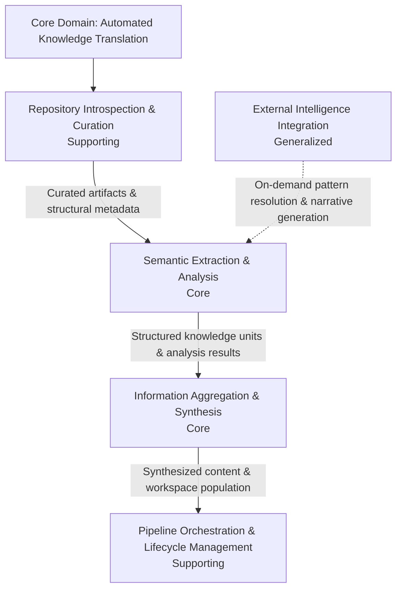
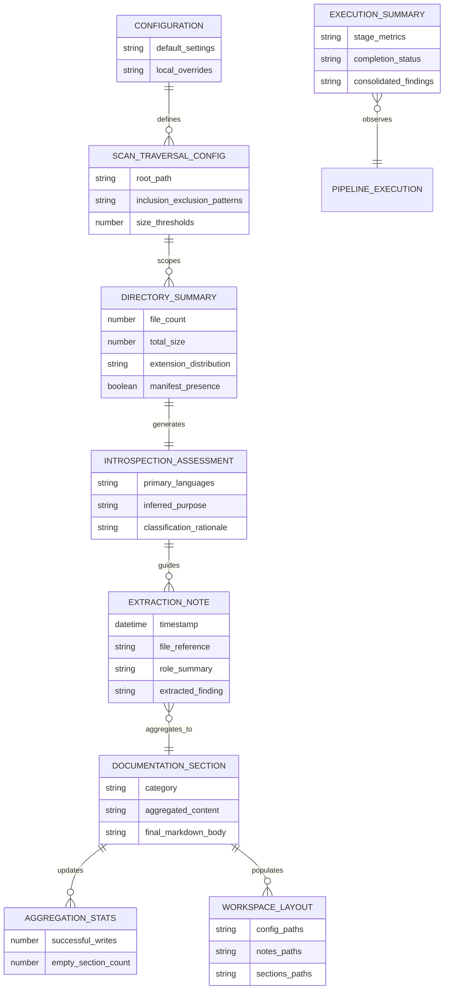
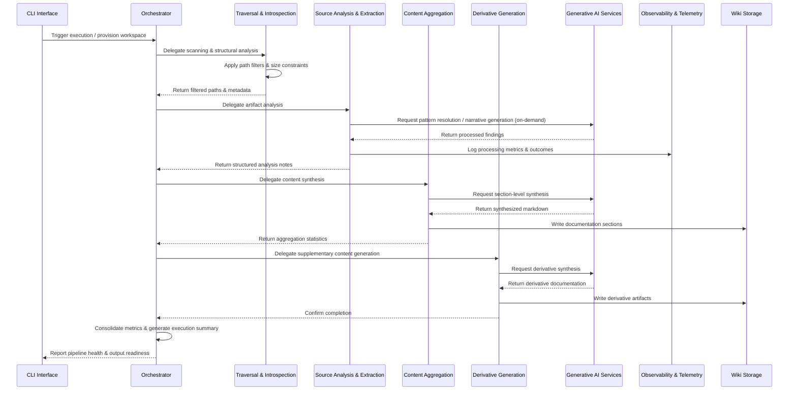

# Diagrams

### Domain Map
The following graph visualizes the bounded contexts within the core domain of Automated Knowledge Translation. It reflects the strict, stage-gated dependency chain and the cross-cutting nature of external intelligence integration.

**Key Observations:**
- Data flows unidirectionally through the pipeline, with intermediate states explicitly persisted between stages to support incremental processing, auditability, and fault tolerance.
- External Intelligence Integration operates as a generalized, cross-cutting capability invoked on-demand within the extraction context rather than dictating pipeline progression.
- Orchestration and workspace lifecycle management responsibilities currently overlap; future modeling may require separating execution coordination from directory/configuration governance.

### Entity Relationship View
This entity-relationship diagram maps the core domain entities, their primary fields, and the structural boundaries that govern data transformation from raw repository scanning to final documentation assembly.

**Key Observations:**
- Configuration entities establish hard boundaries for traversal and analysis, ensuring processing never exceeds defined size constraints or excluded paths.
- Extraction notes are immutable, timestamped records tied to single source files, serving as the raw material for downstream aggregation.
- Aggregation statistics and the execution summary function as cross-cutting observers, tracking pipeline health and output readiness without interfering with the primary data flow.
- **Known Gap:** The exact mapping rules between intermediate extraction notes and final documentation sections are implied but not explicitly detailed. Further specification is required to define how notes are grouped, prioritized, or filtered during section assembly, and how empty sections are resolved or reported upstream.

### Integration Flow
The sequence diagram below illustrates the internal pipeline handoffs and external interface interactions. It captures the staged execution model, centralized orchestration, and abstracted external dependencies.

**Key Observations:**
- The orchestrator acts as the central coordinator, delegating execution to specialized components in a strict sequence while maintaining a single source of truth for pipeline health.
- All external dependencies are routed through standardized contracts, isolating core business logic from provider-specific implementations and enabling swappable analytical backends.
- Observability and telemetry are integrated directly into the extraction stage to monitor processing metrics and record analysis outcomes in real time.
- **Known Gaps:** The integration contracts do not specify exact data schemas or serialization formats for inter-module handoffs. Error handling, retry policies, fallback mechanisms for external service degradation, authentication/rate-limiting constraints, and versioning guarantees between pipeline stages remain undefined and require clarification in implementation documentation.
