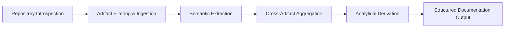

## Capabilities

### Value Proposition
The system automates the transformation of unstructured or semi-structured technical artifacts into standardized, technology-agnostic documentation. It enables engineering and analysis teams to streamline technical reference generation, facilitate data synthesis, and extract structured insights to support system modernization, architectural re-platforming, and cross-team knowledge transfer. By abstracting manual review processes, it delivers deterministic, reproducible knowledge pipelines that balance analytical thoroughness with operational efficiency, reducing the overhead of documentation maintenance while preserving architectural intent.

### Execution Workflow
The knowledge processing pipeline executes a deterministic, sequential four-stage workflow. Each stage builds upon the previous one, ensuring consistent terminology, deduplicated information, and aligned analytical depth across the entire lifecycle.

1. **Repository Introspection:** The system traverses target directories, aggregates structural metadata, and generates high-level assessments of system purpose and scope boundaries. Condensed directory outlines are produced to establish contextual awareness before deep analysis begins.
2. **Artifact Filtering & Ingestion:** Production-relevant source material, configuration manifests, and documentation are isolated. Non-textual assets, build artifacts, dependencies, and test infrastructure are systematically excluded. Content volume is calculated by stripping formatting whitespace, and ingestion respects configurable size thresholds to prevent processing overload.
3. **Semantic Extraction:** Granular insights are extracted from individual artifacts using external reasoning services. Contextual prompts incorporate system purpose and file content, and outcomes are categorized into successes, failures, truncations, or model-initiated skips. Extracted records are persisted and logically grouped by content section.
4. **Cross-Artifact Aggregation & Derivation:** Granular notes are synthesized into cohesive documentation narratives. The aggregated content is then transformed into stakeholder profiles, functional requirements, behavioral scenarios, and architectural visualizations. Context budgets are enforced during derivation, and generation failures are formally recorded as explicit knowledge gaps rather than omitted.

### Adaptive Configuration and Quality Assurance
Operators can dynamically adjust runtime behavior to match workload characteristics. The system provides structured controls that govern how deeply artifacts are analyzed, how external services are invoked, and how quality thresholds are enforced.

| Configuration Affordance | Operational Impact |
|--------------------------|---------------------|
| **Analytical Depth & Reasoning Intensity** | Governs how thoroughly the system evaluates structural patterns and semantic relationships. Operators can tune these parameters to balance output quality against processing speed based on repository complexity. |
| **Service Integration & Validation** | Interfaces with configurable external intelligence backends through a standardized behavioral contract. Supports both schema-constrained structured data extraction and free-form text generation. Incoming responses are automatically validated against predefined business schemas, with noisy or heavily formatted payloads isolated before downstream processing. |
| **Deterministic Execution & Gap Reporting** | Defaults to sequential processing to guarantee consistent output ordering. When source evidence is insufficient, contradictory, or fails validation, the system explicitly documents these gaps. Execution summaries provide detailed metrics on scope coverage, artifact generation, failure counts, and processing duration. |
| **Offline Simulation & Testing** | A deterministic simulation mode enables controlled testing and offline execution by returning predefined responses, ensuring pipeline reliability without requiring continuous external service connectivity. |
| **Workspace State Management** | Provisions a dedicated operational environment that isolates processing state and organizes artifact storage. Supports safe re-initialization without corrupting existing data, enables targeted removal of intermediate processing artifacts, and provides structured access to predefined documentation sections. Diagnostic verbosity and intermediate note retention are configurable to suit operational preferences. |

### Scope and Boundary Management
The system maintains strict operational boundaries to ensure documentation remains focused on production functionality. It deliberately excludes test infrastructure, build pipelines, and development tooling to prevent scope creep and maintain analytical clarity. Inclusion and exclusion patterns can be selectively applied to refine traversal scope, while dynamic configuration binding ensures environment-specific overrides are resolved consistently. Terminal feedback and structured execution reports provide real-time visibility into progress, allowing operators to monitor pipeline health and adjust parameters mid-cycle if necessary.

### Documented Gaps
The precise mechanisms for resolving conflicting insights across multiple artifacts during the aggregation phase are not fully specified. Performance benchmarks or threshold values for the configurable analytical depth and reasoning intensity parameters are not provided. The exact criteria used by the external intelligence services to classify system purpose and scope boundaries during introspection remain abstracted, and the system does not currently document how partial extraction failures are weighted against successful artifacts when calculating overall scope coverage metrics.
