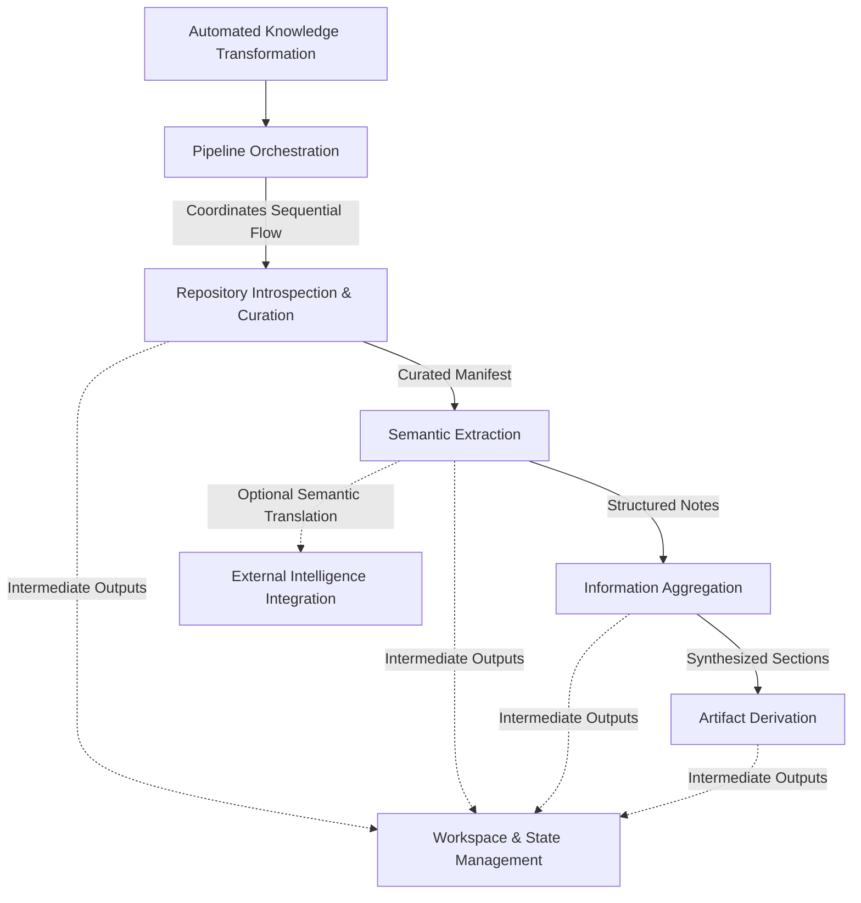
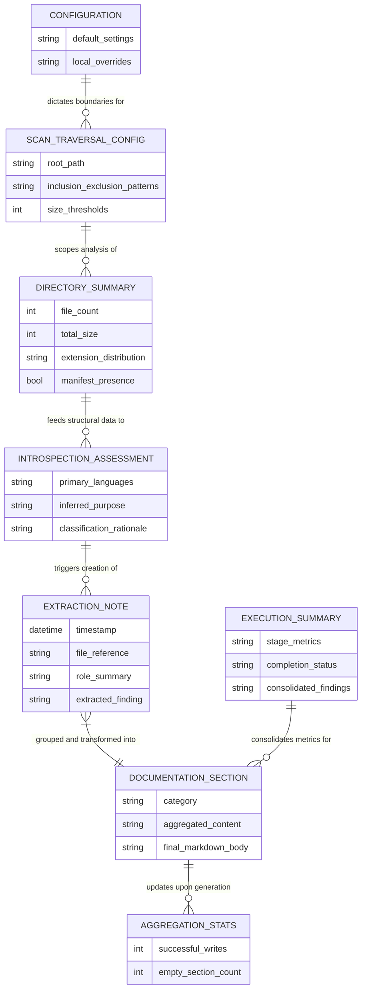
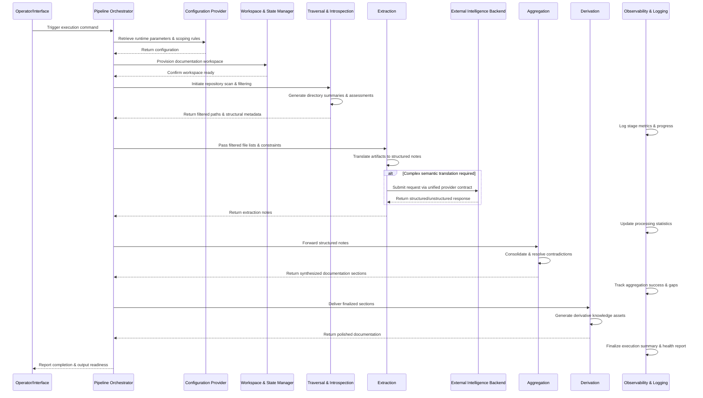

# Diagrams

### Domain Map
The following graph visualizes the primary bounded context and its decomposition into specialized subdomains. It highlights the sequential dependency chain coordinated by the orchestration layer, alongside supporting contexts that persist state and provide generative capabilities.

### Entity Relationship View
This entity-relationship diagram maps the core domain objects, their primary attributes, and the structural dependencies that govern data flow through the pipeline. Relationships reflect the hierarchical configuration model, analysis boundaries, and cross-cutting observation points.

### Integration Flow
The sequence diagram illustrates the runtime orchestration lifecycle, stage handoffs, external service abstraction, and observability integration. It emphasizes the unidirectional data flow and the centralized configuration contract that governs execution.

### Modeling Constraints & Documented Gaps
The diagrams above reflect the architectural boundaries and data flows explicitly defined in the upstream specifications. The following areas remain unspecified and are intentionally omitted from the visual models:
- **Note-to-Section Mapping Rules:** The exact grouping, prioritization, or filtering logic used during section assembly is implied by the aggregation process but not formally defined.
- **Error Handling & Resilience:** Retry mechanisms, fallback behaviors, and conflict resolution strategies for external service failures or stage interruptions are not documented.
- **Inter-Stage Serialization:** The precise data exchange format used between pipeline stages is undefined, though the flow assumes structured, technology-agnostic payloads.
- **State Consolidation Boundary:** Pipeline orchestration and workspace management are modeled as distinct contexts; if execution coordination and state persistence are tightly coupled in practice, they may warrant consolidation into a single bounded context.
