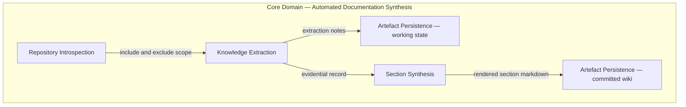
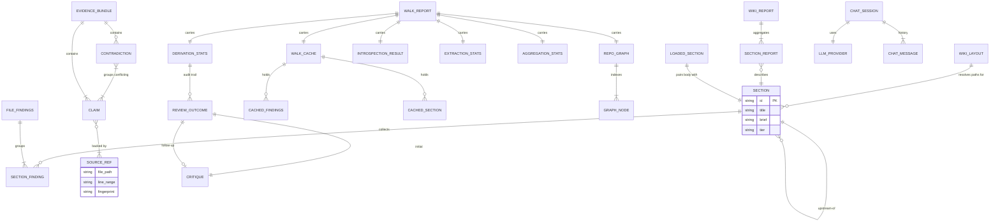
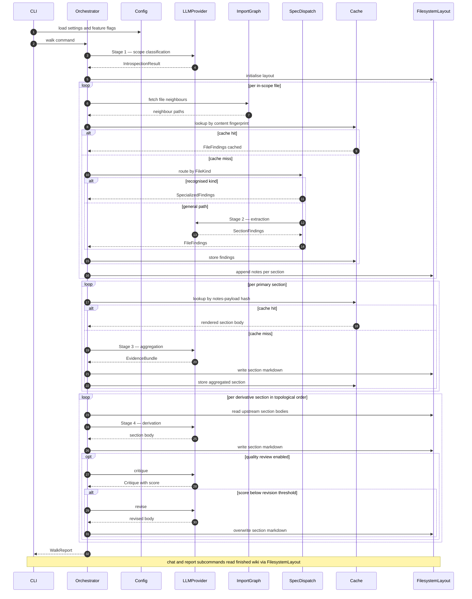

# Diagrams

Three diagrams follow: a domain map, an entity–relationship view, and an integration flow. All representations are technology-agnostic and derived solely from the documented system model.

## Domain Map

Subdomains, their responsibilities, and the directed dependency chain that governs pipeline ordering. No subdomain reaches backwards; the arrows below are the authoritative expression of inter-subdomain dependency.

## Entity Relationship View

Core entities across all concern areas. Cardinality follows the documented information model.

## Integration Flow

End-to-end pipeline sequence from CLI invocation through all four stages, showing each stage's interactions with the LLM provider abstraction, the cache layer, the import graph, and the filesystem layout.

