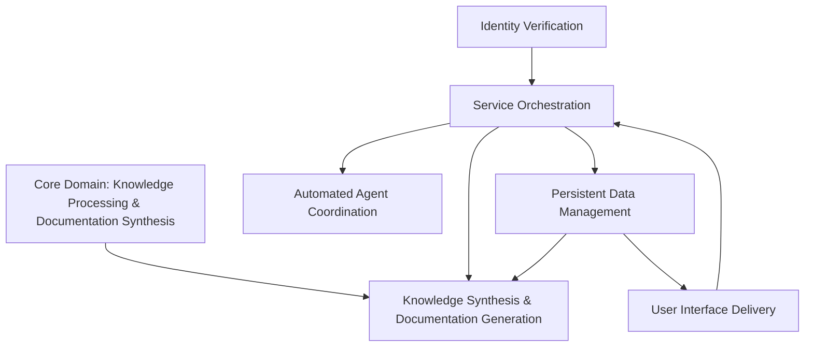
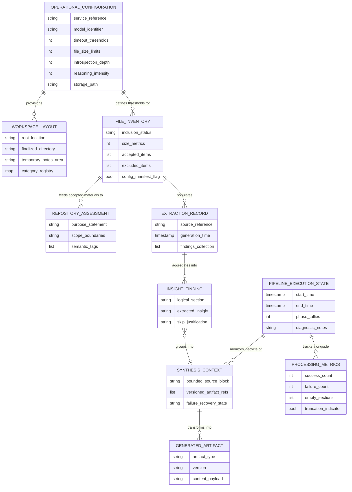
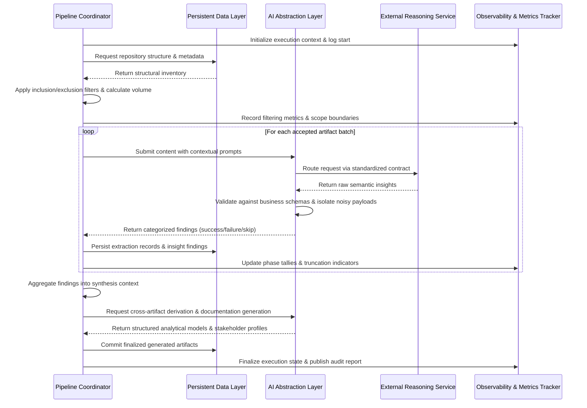

## System Architecture & Knowledge Processing Pipeline

### Domain Map

**Key Observations:**
- The core domain directly implements the primary value proposition: translating unstructured or legacy artifacts into technology-agnostic documentation and analytical models.
- Service orchestration acts as the central coordinator, enforcing deterministic execution boundaries, routing data to synthesis capabilities, and managing external intelligence interactions.
- Persistent data management supports both the synthesis pipeline and the presentation layer, ensuring intermediate states and finalized outputs remain isolated and versioned.
- Identity verification and user interface delivery are classified as generalized contexts, providing standard access control and monitoring capabilities without influencing core analytical logic.
- Strict boundary enforcement prevents cross-context data leakage, ensuring each capability operates within defined interaction contracts and state constraints.

### Entity Relationship View

**Key Observations:**
- Configuration entities drive workspace provisioning and establish filtering thresholds, ensuring deterministic environment resolution without hardcoded values.
- File inventory and repository assessment form the foundational ingestion layer, categorizing materials by relevance, size, and structural priority before deep analysis.
- Extraction records and insight findings maintain relational integrity through mandatory timestamps, unique identifiers, and schema-validated payloads.
- The synthesis context acts as a bounded transformation container, enforcing context constraints and tracking failure recovery states before committing to immutable generated artifacts.
- Execution state and processing metrics provide authoritative post-run auditability, reconciling phase tallies, truncation events, and diagnostic notes across the entire pipeline lifecycle.

### Integration Flow

**Key Observations:**
- The pipeline follows a deterministic, sequential handoff pattern, ensuring consistent ordering and predictable state transitions across all processing phases.
- The AI abstraction layer enforces strict provider isolation, routing requests through a standardized behavioral contract and validating responses against predefined business schemas before downstream consumption.
- Observability tracking is interleaved throughout execution, capturing phase-level success/failure tallies, truncation events, and diagnostic notes without halting progression on isolated errors.
- Storage interactions are batched and versioned, isolating intermediate extraction artifacts from finalized documentation outputs to support safe re-initialization and failure recovery.
- Fault tolerance is prioritized over immediate error visibility; processing continues despite individual extraction failures, with gaps explicitly recorded rather than causing pipeline termination.

### Documented Gaps
- Performance benchmarks, acceptable latency thresholds, and resource consumption limits for external service interactions are not defined.
- Detailed quality threshold metrics and validation rules applied during the aggregation and derivation phases lack explicit numerical or categorical boundaries.
- Data retention policies, lifecycle management rules, and cleanup procedures for intermediate extraction artifacts and workspace states are unspecified.
- Criteria for determining when a repository is deemed structurally unsuitable for automated analysis, or when manual intervention is required, are not established.
- Exact failure recovery mechanisms and retry logic boundaries for degraded or unresponsive external intelligence services remain undefined.
- The precise mechanisms for resolving conflicting insights across multiple artifacts during the aggregation phase are not fully specified.
- Performance benchmarks or threshold values for the configurable analytical depth and reasoning intensity parameters are not provided.
- The exact criteria used by external intelligence services to classify system purpose and scope boundaries during introspection remain abstracted.
- The system does not currently document how partial extraction failures are weighted against successful artifacts when calculating overall scope coverage metrics.
- Exact runtime interaction contracts between bounded contexts lack concrete message formats, synchronization primitives, or API boundaries.
- Specific state persistence mechanisms, including storage topology, caching strategies, transaction boundaries, or consistency models, are not detailed.
- The precise sequence of external intelligence service interactions, including how responses are validated, merged, or weighted during synthesis, remains unspecified.
- Error handling and failure recovery workflows lack defined retry policies, circuit-breaking behavior, state rollback procedures, or timeout thresholds.
- The mapping between legacy source artifacts and the newly identified bounded contexts lacks concrete examples or transformation rules.
- The exact transformation rules or validation gates applied between the synthesis context and generated artifacts are undefined.
- Allowable nesting depth, supported data types, and serialization constraints for flexible nested data storage are not detailed.
- The contract for external intelligence service invocation, including retry logic, payload size limits beyond general byte constraints, and error classification boundaries, is absent.
- The mapping of logical sections to specific documentation templates or output formats is implied but not explicitly defined.
