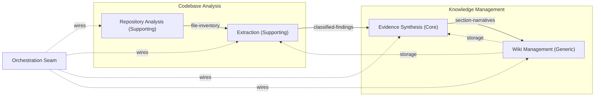
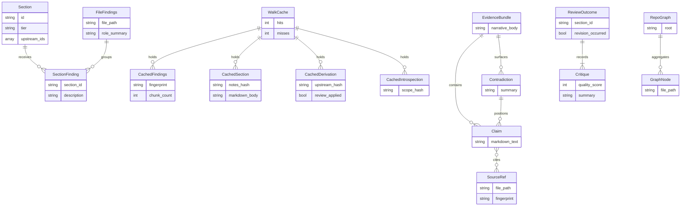
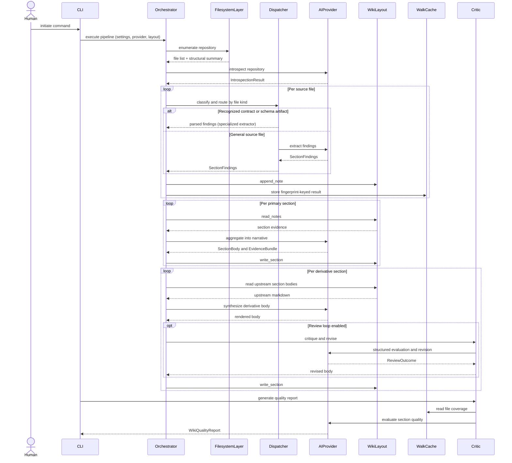

# Diagrams

## Domain Map

The four subdomains, their classification types, and the direction of data and storage dependencies. Solid arrows carry artifacts; dashed arrows indicate storage-contract or orchestration dependencies. The orchestration seam does not own domain logic — it wires the subdomains together end-to-end.

---

## Entity Relationship View

Key entities across the extraction, aggregation, derivation, caching, and review subsystems. Only structurally significant relationships are shown; fields are representative rather than exhaustive.

---

## Integration Flow

A full pipeline run from command invocation to quality reporting. The AI provider is shown as a single abstract surface; the three concrete backends are not distinguished here. The wiki layout acts as the internal artifact bus linking extraction, aggregation, and derivation stages, and the walk cache provides a parallel fingerprint-keyed channel.

