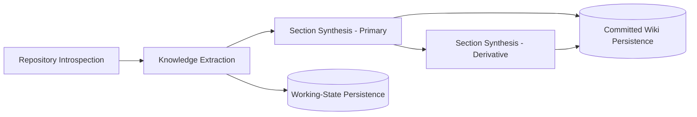
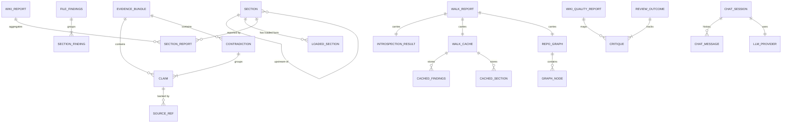
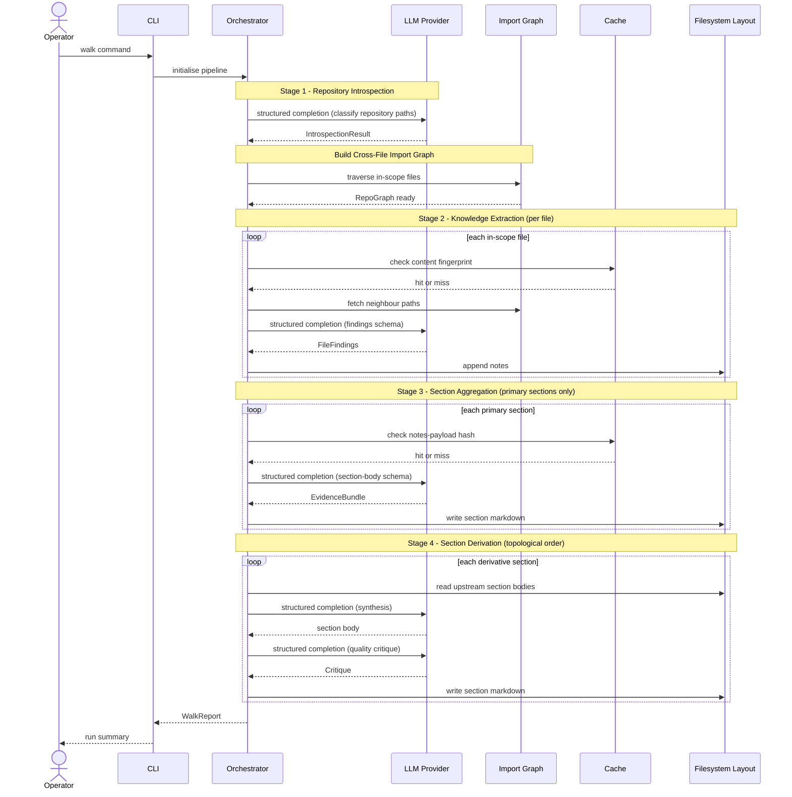

# Diagrams

The three diagrams below cover the subdomain structure of the core domain, the structural relationships between the principal entities, and the end-to-end pipeline integration flow.

---

## Domain Map

The four subdomains that compose the core domain of automated documentation synthesis form a strict directed dependency chain. No subdomain reaches backward; the ordering is a first-class design constraint.

---

## Entity Relationship View

The diagram spans six concern areas: wiki structure, evidence tracing, extraction, pipeline orchestration, caching, and quality review. The self-referential edge on **Section** represents the directed acyclic graph of upstream declarations enforced by topological ordering at startup.

---

## Pipeline Integration Flow

The sequence below traces a complete pipeline run triggered by the `walk` command. The provider abstraction is the sole contact point for all inference calls; the filesystem layout abstraction mediates all reads and writes; the cache layer short-circuits calls when prior results remain valid. Derivative sections are excluded from the aggregation stage and are handled exclusively in the derivation stage.

> **External capability providers**: The system is additionally configured as a client that fans out to multiple external capability providers via a tool-server protocol — a local AI utility, a local web crawler, a remote documentation context service, and a remote stitching/search service. The upstream sections do not specify at which pipeline call sites these providers are invoked.
