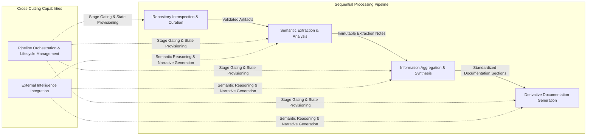
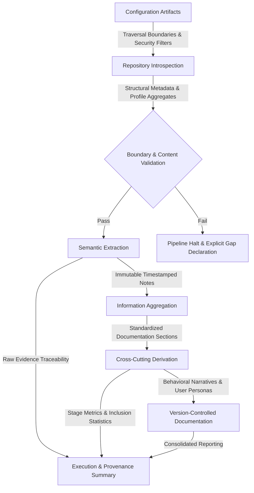
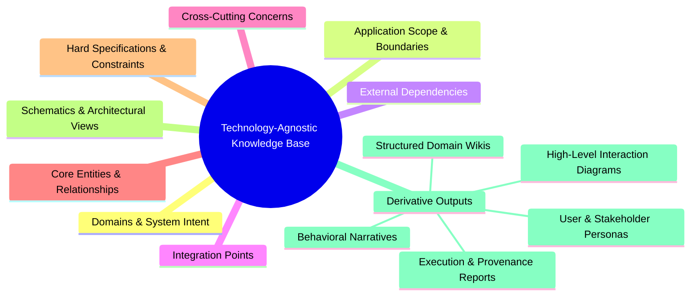

### Domain Context & Processing Flow
- Represents the five bounded contexts governing automated knowledge translation
- Enforces unidirectional, stage-gated data progression with strict validation boundaries
- Abstracts cross-cutting orchestration and external reasoning capabilities
- Maintains technology-agnostic labeling aligned with strategic DDD classifications

### Entity Transformation Lifecycle
- Maps deterministic artifact progression across configuration, introspection, extraction, aggregation, and derivation phases
- Enforces immutability contracts and explicit gap declaration for insufficient source evidence
- Illustrates strict separation between transient processing states and version-controlled outputs
- Guarantees full transformation lineage and fault-tolerant stage resumption

### Integration Boundary & Service Touchpoints
| Integration Domain | Direction | Contract Type | Primary Responsibility |
|---|---|---|---|
| Host Repository | Inbound | Filesystem Traversal | Source ingestion, manifest extraction, dependency noise filtration |
| AI Inference Engine | Outbound | Provider Abstraction | Semantic code analysis, structured data extraction, narrative generation |
| Configuration Layer | Bidirectional | Hierarchical Override | Parameter resolution, credential isolation, workspace mapping |
| Pipeline Orchestrator | Internal | Stage Gating | Sequential handoff, fail-fast validation, metric aggregation |
| Workspace Storage | Internal | State Persistence | Immutable note logging, execution summary generation, lineage tracking |
| CI/CD & VCS Hooks | Inbound | Validation Gates | Quality enforcement, test execution, concurrency management |
| Observability System | Bidirectional | Cross-Cutting Tracking | Progress monitoring, anomaly detection, health reporting |

### Documentation Taxonomy & Output Structure
- Visualizes the fixed classification system governing synthesized knowledge artifacts
- Aligns output categories with migration support objectives and stakeholder consumption patterns
- Enforces technology-agnostic terminology and explicit separation of architectural concerns
- Maintains deterministic output schemas with backward-compatible directory structures

