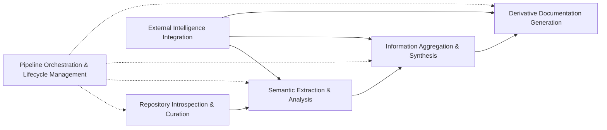
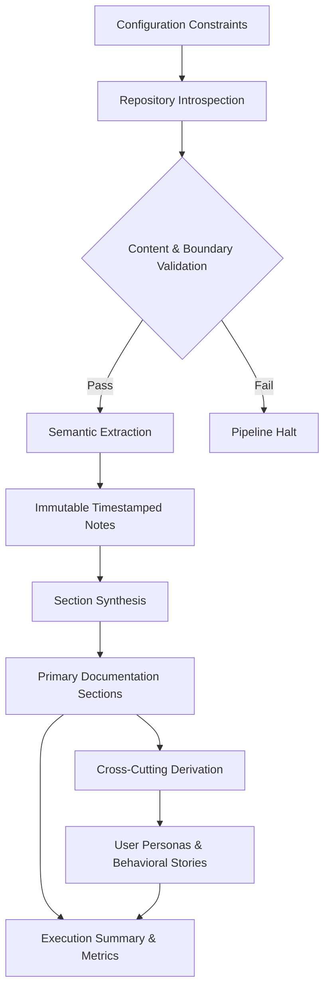
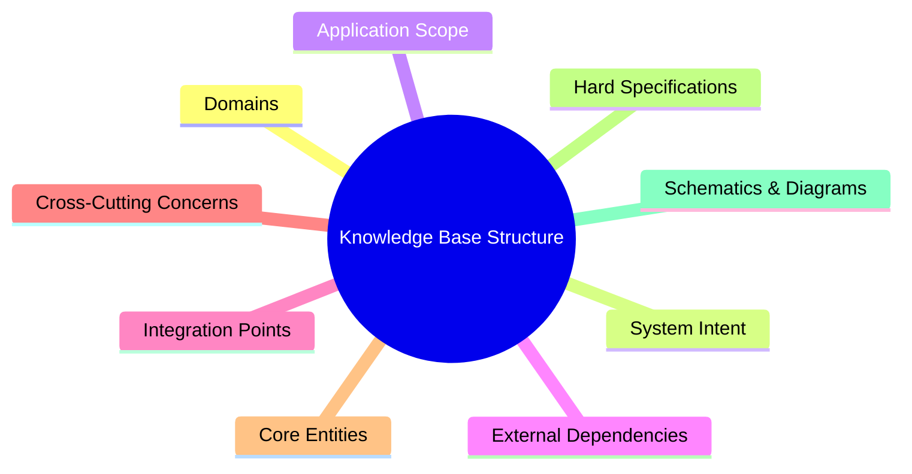

### Domain Context Architecture
- The knowledge translation pipeline operates within five bounded contexts that enforce unidirectional data flow and stage-gated progression.
- Intermediate analysis states are explicitly persisted to guarantee fault tolerance, deterministic execution, and full transformation lineage.
- External intelligence functions as a cross-cutting capability, injected during extraction and synthesis phases while maintaining strict abstraction boundaries.

### Pipeline Entity Transformation
| Processing Stage | Primary Input Entity | Output Entity | Operational Boundary & Invariant |
|---|---|---|---|
| Configuration Resolution | Environment defaults / Local overrides | Configuration Constraints | Local artifacts strictly supersede environment variables; sensitive credentials are stripped before runtime injection. |
| Repository Introspection | Raw repository structure | Structural Assessment | Hard traversal boundaries and size thresholds filter non-essential artifacts; execution halts on validation failure. |
| Semantic Extraction | Validated source artifacts | Immutable Extraction Notes | Timestamped notes preserve raw evidence; ambiguous data triggers explicit gap declaration rather than inference. |
| Section Aggregation | Consolidated extraction notes | Primary Documentation Sections | Fixed taxonomy alignment; schema validation enforces technology-agnostic terminology and narrative coherence. |
| Cross-Cutting Derivation | Primary documentation sections | User Personas & Behavioral Stories | Context window limits prevent token exhaustion; output strictly maps multi-component relationships without fabrication. |
| Execution Reporting | Stage metrics & completion status | Execution Summary | Atomic statistics tracking; guarantees a standardized report only after full lifecycle completion. |

### Documentation Taxonomy Structure
- The synthesis engine maps aggregated findings into a fixed classification system to ensure consistent knowledge base navigation.
- Each category undergoes structured validation, enforcing domain-centric language and explicit separation of architectural concerns.
- Intermediate processing artifacts remain isolated from version-controlled outputs to preserve structural immutability and auditability.

