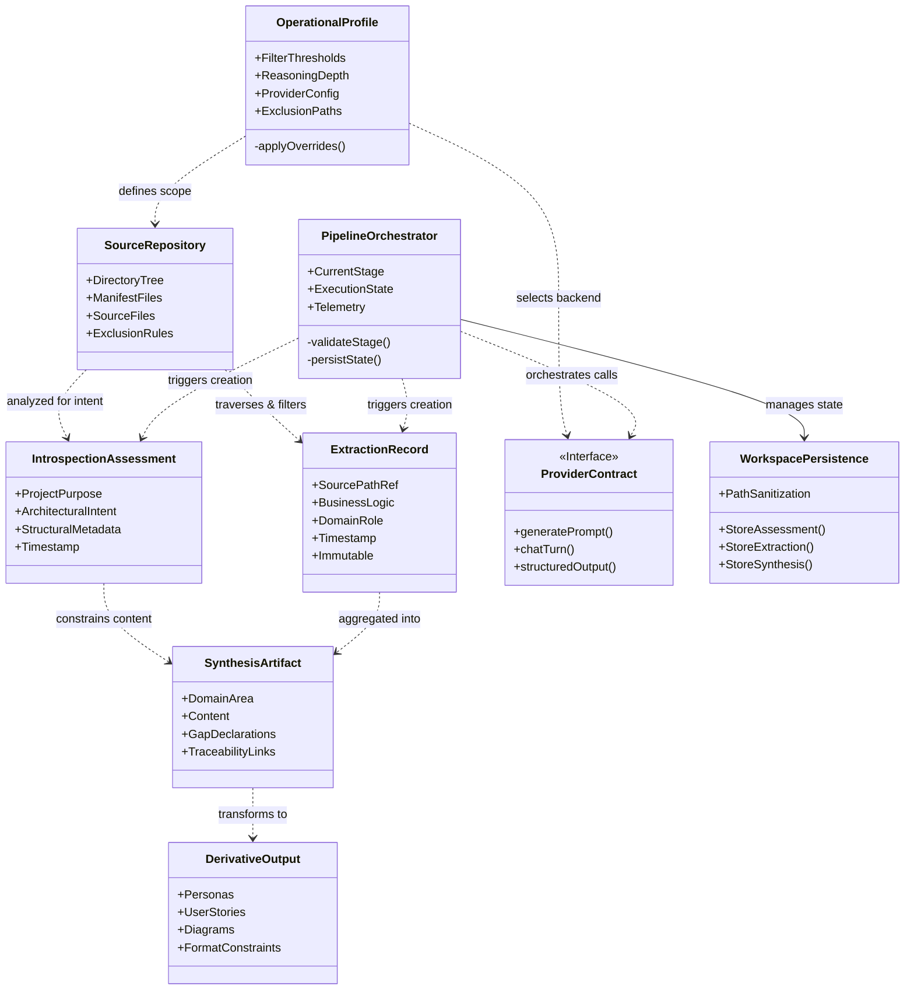

## Core Domain Entities

The system manages a set of domain entities that represent the analysis pipeline, source context, configuration state, and generated artifacts. These entities are structured to support a deterministic, stage-gated workflow that transforms unstructured technical repositories into technology-agnostic domain documentation.

| Entity Category | Entity Name | Structural Description | Persistence / Representation |
| :--- | :--- | :--- | :--- |
| **Context** | Source Artifact Collection | The target repository directory containing source files, manifests, and configuration artifacts subject to analysis. | File system hierarchy; traversed recursively with exclusion semantics. |
| **Context** | Workspace Manifest | Metadata tracking the state of the analysis workspace, including path mappings and sanitized file references. | Serialized workspace state; isolated from version control. |
| **Configuration** | Operational Profile | Parameters governing file filtering thresholds, reasoning depth, exclusion rules, and provider selection. | Hierarchical configuration; local overrides take precedence over environment variables. |
| **Analysis** | Introspection Assessment | High-level inference of project purpose, architectural intent, and structural composition derived from manifest and directory analysis. | Immutable assessment record; timestamped for traceability. |
| **Analysis** | Extraction Record | Granular semantic findings associated with individual source artifacts, capturing business logic and domain roles. | Serialized note format linked to sanitized source paths; immutable upon creation. |
| **Output** | Synthesis Artifact | Technology-agnostic documentation sections organized by canonical domain areas (e.g., DDD modeling, integration flows). | Structured markup sections; schema-validated or narrative format. |
| **Output** | Derivative Output | Secondary artifacts such as user personas, behavioral stories, and system diagrams generated from synthesis data. | Standardized formats (e.g., Gherkin, diagram markup); constrained by system purpose. |
| **Infrastructure** | Provider Contract | Abstraction interface defining interaction protocols with external intelligence services for semantic reasoning. | Standardized client interface; supports direct prompt and multi-turn modes. |
| **Lifecycle** | Pipeline State | Execution telemetry tracking progress through introspection, extraction, synthesis, and derivation stages. | Transient or persisted execution summary; includes error logging and success metrics. |

## Structural Composition

### Source Artifact Management
The system models source repositories as collections of artifacts filtered by content substance and exclusion rules. The traversal logic merges configuration-driven exclusions with repository hygiene semantics to isolate processable data.

*   **Scope Control:** File inclusion is gated by minimum content size thresholds to filter noise. Large files are retained for potential downstream truncation rather than exclusion, balancing completeness with processing efficiency.
*   **Manifest Detection:** The entity structure explicitly identifies manifest files (build configurations, documentation, AI-context files) to capture project structure and intent metadata alongside code.

**Given** a configuration threshold for minimum content size and a set of exclusion paths,  
**When** the traversal engine encounters a file within the target directory,  
**Then** the file is included for analysis only if it meets the size requirement and is not matched by exclusion rules; otherwise, it is skipped without halting the pipeline.

### Configuration Hierarchy
Operational parameters are encapsulated in a configuration profile that enforces deterministic behavior. The profile supports hierarchical overrides, ensuring that explicit local settings dominate default or environment-based values.

*   **Parameterization:** Configuration includes tunable reasoning depth to balance processing time against analytical quality, and explicit bounds on file size/content length to prevent resource waste.
*   **Immutability:** The output directory schema is immutable to ensure backward compatibility across runs.

**Given** a conflict between local configuration values and environment variables,  
**When** the system initializes the operational profile,  
**Then** local configuration values are applied, preserving the override precedence contract.

### Analysis Entities
Analysis entities represent the transformation of raw data into structured insights. The pipeline enforces a strict separation between structural assessment and semantic extraction.

*   **Introspection:** Performs directory-level analysis to infer project intent and identify key artifacts. This produces an assessment used to constrain downstream synthesis.
*   **Extraction:** Executes file-level parsing to extract business logic and domain roles. Implementation-specific details are filtered out. Extraction records are immutable and timestamped to provide provenance.
*   **Synthesis:** Aggregates extraction notes and introspection data to generate documentation across eight core domain areas. Synthesis enforces technology independence and prohibits content fabrication.

**Given** a request to synthesize documentation content,  
**When** the synthesis engine encounters an ambiguity or missing information in the extraction records,  
**Then** the system must explicitly declare a gap in the output rather than inferring or fabricating content.

### Derivative and Provider Structures
Derivative outputs are constrained by the assessed system purpose and formatted according to domain standards. The provider contract decouples core logic from specific intelligence backends.

*   **Derivation Integrity:** Derivation logic requires explicit declarations for missing information. Outputs are constrained to technology-agnostic formats and must align with the inferred system purpose.
*   **Provider Abstraction:** The provider contract standardizes AI interactions into core modes supporting structured output and asynchronous execution. This allows seamless backend substitution without disrupting the pipeline.

**Given** a configured provider type that is unsupported or unconfigured,  
**When** the factory attempts to instantiate the provider client,  
**Then** the system fails fast with a validation error, preventing execution with undefined intelligence capabilities.

## Operational Behaviors

### File Filtering and Noise Reduction
The system applies deterministic filtering to ensure computational resources are focused on substantive artifacts.

**Given** a file size exceeds the configured upper bound or content length falls below the lower bound,  
**When** the walker evaluates the artifact during traversal,  
**Then** the file is marked as filtered and excluded from extraction, unless it is flagged for downstream truncation.

### Gap Preservation and Traceability
Documentation generation strictly adheres to evidence-based synthesis rules.

**Given** a generated documentation section,  
**When** a claim cannot be substantiated by extraction records or introspection data,  
**Then** the section must include a gap marker or explicit limitation statement, preserving traceability to source artifacts.

### State Isolation and Persistence
Intermediate states are managed to support incremental processing and fault tolerance.

**Given** a pipeline execution failure at a specific stage,  
**When** the orchestrator resumes processing from a saved checkpoint,  
**Then** intermediate artifacts are preserved, and processing continues from the failed stage without re-processing successful upstream stages.

## Entity Relationship Schematic

The following diagram illustrates the relationships between core entities, the data flow through the pipeline, and the structural dependencies.

## Specification Gaps

The following gaps have been identified in the entity structures and operational definitions. These areas require clarification to ensure complete implementation fidelity.

*   **Note-to-Section Mapping Logic:** Explicit rules governing how intermediate extraction notes are mapped, prioritized, or filtered into final documentation sections are currently undefined.
*   **Heuristics for Artifact Classification:** Strategies for classifying non-essential artifacts and handling contradictory insights between extraction records are missing.
*   **Data Serialization Schemas:** Specific serialization schemas for module handoffs and inter-module data exchange are not specified.
*   **Security and Access Controls:** Authentication, authorization, and data access control requirements remain undefined across entities.
*   **Error Handling and Retry Contracts:** Operational contracts for retry mechanisms, fallback strategies, and detailed error handling during pipeline stages are incomplete.
*   **Configuration Presets:** Definitions for configuration presets and conflict resolution strategies are absent.