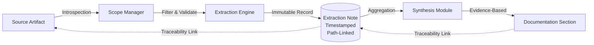

## Observability and Traceability

The system enforces strict traceability between generated documentation and source artifacts to ensure auditability and evidence-based synthesis. All analytical insights are persisted as immutable, timestamped records linked to specific file paths, preventing drift and enabling validation of derivation accuracy.

- **Provenance Tracking:** Every extraction note contains metadata linking the insight to the originating source file, including file type, manifest associations, and processing timestamps.
- **Gap Declaration:** The system explicitly marks sections where source data is insufficient, ensuring documentation reflects the true state of knowledge without speculative content.
- **Execution Telemetry:** Pipeline progress, success metrics, and stage completion status are tracked centrally to support diagnostics and operational visibility.

> **Given** a source artifact is analyzed during the extraction phase,  
> **When** the system identifies business logic or architectural intent,  
> **Then** an immutable extraction note is generated linking the insight to the artifact path and timestamp, and this note is referenced in the synthesized documentation to maintain provenance.

## State Management and Execution Resilience

The pipeline operates as a deterministic, stage-gated workflow with idempotent state management to ensure reliability and support incremental processing. Intermediate states are persisted to allow recovery and fault tolerance without data loss.

- **Strict Sequence:** Execution follows a mandatory four-stage order: Introspection → Extraction → Aggregation → Derivation. Deviations are prohibited to maintain data consistency.
- **Non-Destructive Processing:** The system never modifies source repositories. All operations are read-only regarding inputs, with outputs isolated in a dedicated workspace.
- **Fault Tolerance:** Invalid inputs or processing errors trigger logging and skipping mechanisms; the pipeline continues without halting, ensuring partial results are preserved.

> **Given** an execution failure occurs during the synthesis stage,  
> **When** the pipeline is re-invoked with the same target repository,  
> **Then** the system resumes from the last persisted intermediate state, skipping completed stages and reprocessing only the affected stage without re-ingesting source data.

## Configuration and Operational Guardrails

Operational parameters are centralized to balance analytical fidelity with resource efficiency. The system supports tunable guardrails for file filtering, reasoning depth, and provider selection, ensuring adaptability across diverse repository characteristics.

- **Resource Efficiency:** Configurable bounds on file size and content length prevent processing of trivial or excessive inputs. Minimum content thresholds filter noise.
- **Reasoning Depth:** A tunable parameter governs the trade-off between processing time and analytical quality, allowing users to optimize for speed or thoroughness.
- **Provider Abstraction:** External intelligence services are integrated via a standardized contract, decoupling core logic from specific backends. Local execution is the default mode, with hosted services treated as optional extensions.
- **Configuration Hierarchy:** Local configuration files override environment variables, ensuring predictable behavior across deployment contexts.

> **Given** a repository contains files exceeding the configured maximum size threshold,  
> **When** the scope manager traverses the directory structure,  
> **Then** those files are excluded from semantic analysis to prevent resource exhaustion, and the exclusion is logged in the execution summary.

## Semantic Integrity and Quality Gates

Documentation generation is governed by strict quality protocols that enforce technology-agnostic outputs and factual accuracy. The system prioritizes domain clarity over technical detail, abstracting implementation specifics to produce portable knowledge bases.

- **Technology Independence:** Outputs are synthesized as domain-focused narratives, stripping language-specific constructs to ensure relevance across architectural migrations.
- **Schema Validation:** Generated content adheres to structured formats, including behavioral descriptions using standardized conditional logic and diagrammatic representations following domain conventions.
- **No Fabrication Policy:** The system prohibits inference beyond evidence. Ambiguities result in explicit gap markers rather than assumed values.

> **Given** the analysis engine encounters contradictory information across multiple source files,  
> **When** synthesizing the final documentation,  
> **Then** the system flags the contradiction as a gap and requires manual resolution, preventing the propagation of inconsistent assumptions.

## External Intelligence Integration

The system isolates AI-driven capabilities behind abstraction layers to ensure backend interchangeability and consistent interaction patterns. This design supports seamless substitution of inference engines without impacting pipeline integrity.

- **Standardized Contracts:** All provider integrations must support direct prompt generation and multi-turn dialogue, with mandatory structured output capabilities.
- **Dynamic Configuration:** Provider selection and parameter mapping are driven by configuration, allowing runtime adaptation without code changes.
- **Fail-Fast Validation:** Unsupported or misconfigured providers trigger immediate errors during initialization, preventing partial execution states.

> **Given** a new external intelligence service is available and compliant with the provider contract,  
> **When** the system configuration is updated to reference the new service,  
> **Then** the pipeline integrates the service transparently, utilizing its inference capabilities without modifying core extraction or synthesis logic.

## Identified Specification Gaps

The following cross-cutting areas lack defined requirements or implementation strategies. These gaps must be addressed to achieve production readiness.

| Concern | Gap Description |
| :--- | :--- |
| **Security and Access Control** | Authentication, authorization, and data isolation mechanisms for multi-user or shared workspace scenarios are undefined. |
| **Error Handling and Retries** | Specific strategies for transient failure recovery, retry logic, and fallback behaviors during provider unavailability are not specified. |
| **Artifact Classification Heuristics** | Rules for classifying non-essential artifacts and reconciling conflicting exclusion policies across diverse repository structures are missing. |
| **Mapping Logic** | The deterministic logic governing how intermediate extraction notes are prioritized, filtered, and mapped to final documentation sections is not fully defined. |
| **Data Serialization Schemas** | Formal contracts for inter-module data exchange and intermediate state serialization are absent, posing risks for module handoffs. |