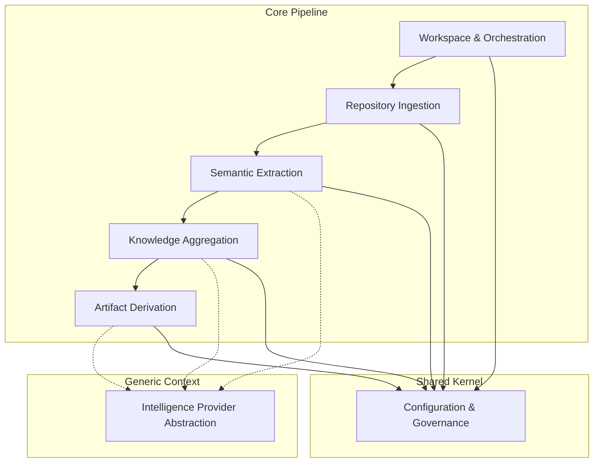

## Strategic Domain Model

The **Automated Knowledge Translation System** operates within the domain of **Legacy-to-Domain Knowledge Extraction**. Its core purpose is to decouple business intent from technical implementation by transforming unstructured source artifacts into structured, technology-agnostic documentation. The system functions as a deterministic engine that ingests repository data, infers architectural and functional context, and synthesizes deliverables that enable downstream teams to rebuild or understand systems without referencing original code.

The domain is characterized by a strict separation between **analysis** and **synthesis**. The system does not perform code transformation or migration; it exclusively generates knowledge artifacts. External intelligence is treated as a swappable capability rather than a core dependency, ensuring the domain logic remains stable regardless of the underlying analysis backend.

### Bounded Context Architecture

The system is decomposed into bounded contexts that enforce clear responsibilities and minimize coupling. The architecture follows a unidirectional, stage-gated pipeline pattern supported by shared abstractions.

*   **Workspace & Orchestration**: Manages lifecycle, state persistence, and execution flow.
*   **Repository Ingestion**: Handles scope definition, traversal, and initial filtering.
*   **Semantic Extraction**: Analyzes artifacts to infer roles, responsibilities, and extract structured notes.
*   **Knowledge Aggregation**: Merges extraction results into cohesive domain narratives.
*   **Artifact Derivation**: Generates derivative content such as personas, user stories, and diagrams.
*   **Intelligence Provider Abstraction**: Standardizes interaction with external analysis engines.
*   **Configuration & Governance**: Centralizes parameters, thresholds, and quality constraints.

## Subdomain Responsibilities

| Bounded Context | Subdomain Type | Responsibility | Key Deliverables |
| :--- | :--- | :--- | :--- |
| **Repository Ingestion** | Supporting | Defines analysis scope, traverses directory structures, applies exclusion rules, identifies manifest files, and filters content based on size/substance thresholds. | Scope Manifest, File Inventory, Introspection Assessment. |
| **Semantic Extraction** | Core | Parses individual artifacts to infer business logic, technical context, and domain roles. Generates immutable extraction notes linked to source provenance. | Extraction Notes, Role Assignments, Functional Responsibilities. |
| **Knowledge Aggregation** | Core | Aggregates extraction notes and introspection data to synthesize technology-agnostic documentation. Enforces fidelity rules and gap detection. | Documentation Sections, Domain Narratives, Gap Reports. |
| **Artifact Derivation** | Supporting | Transforms synthesized content into structured derivatives aligned with domain standards (e.g., Gherkin, Mermaid). | User Personas, User Stories, System Diagrams. |
| **Intelligence Provider** | Generic | Abstracts external analysis capabilities. Provides uniform interfaces for prompt generation and structured output retrieval without exposing backend specifics. | Standardized AI Client, Provider Factory, Response Normalization. |
| **Workspace Orchestration** | Supporting | Coordinates pipeline execution, manages intermediate state, ensures fault tolerance, and handles serialization of results. | Execution Summary, State Artifacts, Telemetry Logs. |

## Core Entities and Aggregates

The domain model relies on immutable records to ensure traceability and reproducibility. Aggregates are designed to support atomic operations within the pipeline stages.

*   **Extraction Note (Value Object)**: An immutable record capturing findings from a single artifact. Contains timestamp, sanitized source path, inferred role, and extracted content. Cannot be modified post-creation to preserve auditability.
*   **Introspection Assessment (Entity)**: Represents the high-level understanding of the repository. Includes purpose inference, technology classification, and structural metadata. Updated atomically during the introspection phase.
*   **Documentation Section (Aggregate)**: A cohesive unit of synthesized content. Aggregates multiple extraction notes and validation results. Enforces rules regarding technology agnosticism and gap declaration.
*   **Workspace (Aggregate Root)**: Encapsulates the entire analysis context. Manages configuration, inputs, intermediate states, and generated outputs. Provides the boundary for persistence and state transitions.
*   **Configuration (Value Object)**: Hierarchical parameter set governing thresholds, reasoning depth, exclusions, and provider selection. Local definitions override environmental variables.

## Behavioral Rules

Operational behaviors are governed by deterministic rules to ensure consistency and prevent speculative content.

### Pipeline Execution
*   **Given** a valid workspace and target repository,
*   **When** the analysis pipeline is initiated,
*   **Then** execution must proceed through four distinct stages in strict order: Introspection, Extraction, Aggregation, and Derivation.

### Gap Handling and Fidelity
*   **Given** ambiguous or contradictory information during synthesis,
*   **When** generating documentation content,
*   **Then** the system must explicitly declare the gap or contradiction and must not fabricate content to fill the void.

### Provider Interaction
*   **Given** a configuration specifying an analysis backend,
*   **When** the provider factory initializes the client,
*   **Then** the system must instantiate the corresponding adapter and fail fast if the provider is unsupported or unconfigured.

### Filtering and Scope
*   **Given** a file meets exclusion criteria defined by configuration or ignore semantics,
*   **When** the repository walker traverses the directory,
*   **Then** the file must be excluded from processing regardless of content.

### Fault Tolerance
*   **Given** an invalid input or processing error during a stage,
*   **When** the orchestrator encounters the failure,
*   **Then** the system must log the error, skip the offending artifact, and continue processing without halting the entire pipeline.

## Cross-Cutting Concerns

*   **Traceability**: Every generated artifact must maintain a provenance link to the source extraction notes and original files.
*   **Technology Agnosticism**: All outputs must abstract away implementation details. Descriptions of behavior should use standardized formats (e.g., Given/When/Then) to ensure independence from specific frameworks or languages.
*   **Determinism**: The pipeline must produce consistent results for identical inputs. Non-deterministic elements (e.g., external intelligence) are constrained via structured output requirements and prompt standardization.
*   **State Isolation**: Intermediate artifacts are isolated from version control to prevent repository bloat and ensure clean workspace management.
*   **Security and Access Control**: *Missing Data*: Authentication, authorization, and secure handling of sensitive repository content are not defined in the current specification. This area requires further elaboration to address compliance and data safety.

## Missing Data and Specification Gaps

The following aspects of the domain model lack sufficient definition and are identified as gaps requiring resolution:

1.  **Mapping Logic**: Explicit rules for how intermediate extraction notes are mapped, prioritized, or filtered into final documentation sections are not specified. The derivation path from granular notes to synthesized sections is implicit.
2.  **Error Handling Contracts**: Detailed operational contracts for error handling, retry mechanisms, and fallback strategies across module boundaries are undefined.
3.  **Data Serialization**: Schemas for data serialization between modules are missing, potentially impacting interoperability and state management.
4.  **Conflict Resolution**: Strategies for reconciling contradictory insights inferred from different parts of the repository are not defined.
5.  **Security Model**: No requirements exist for access controls, secret management within the workspace, or authentication for external service integrations.
6.  **Heuristics**: Classifications for non-essential artifacts and heuristics for noise filtration are not formalized, relying on configurable thresholds without domain-driven classification logic.