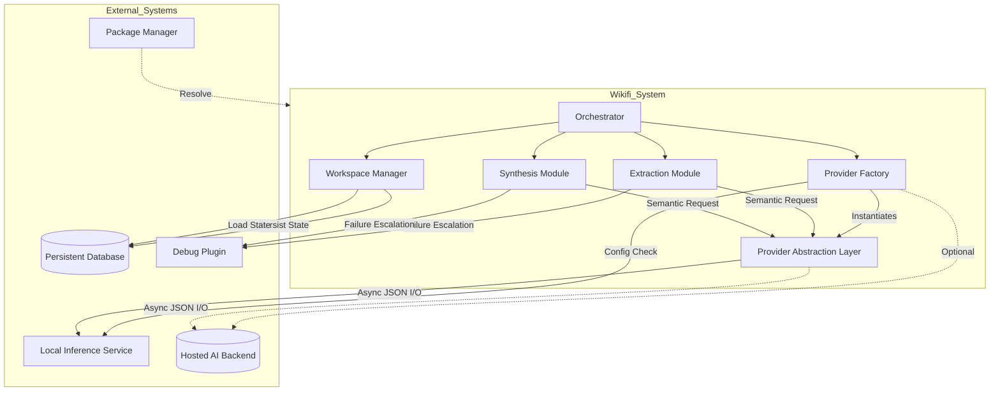

## External-System Dependencies

### Overview
The system operates as an automated knowledge translation engine that relies on a decoupled architecture to maintain technology independence and reproducibility. External dependencies are strictly categorized into abstracted intelligence services, persistent data storage, runtime component libraries, and operational tooling. The system enforces a provider-agnostic contract for all external integrations, ensuring that underlying implementations can be substituted without disrupting core business workflows.

### AI Inference Integration
The core analytical capability of the system depends on an external Large Language Model (LLM) service. This dependency is managed through a mandatory abstraction layer that standardizes interactions, enforces structured outputs, and isolates the application logic from backend-specific protocols.

- **Abstraction Contract:** All AI interactions are routed through a unified provider interface supporting direct prompt generation and multi-turn conversational workflows. The contract requires asynchronous execution and strict adherence to JSON schema validation for structured data exchange.
- **Local-First Default:** The system is configured to prioritize local inference engines with zero cloud dependency by default. This ensures data privacy and operational continuity in isolated environments.
- **Hosted Extensions:** Hosted AI backends are treated as optional extensions. Integration is permitted only through the standardized provider factory, which maps global configuration parameters to provider-specific initialization requirements.
- **Structured Output Enforcement:** The system validates that all AI responses conform to defined JSON structures. If an inference engine fails to produce valid structured output, the request is handled via fallback mechanisms or error logging, preventing pipeline halts due to malformed data.

### Data Persistence Layer
The system provisions an isolated data persistence service to ensure state durability and workspace integrity.

- **Provisioned Storage:** A dedicated database instance is provisioned via infrastructure configuration to manage workspace metadata, extraction notes, and execution telemetry.
- **Isolation and Durability:** Storage is allocated independently from the application runtime, ensuring data survival across container restarts and deployment cycles.
- **Standardized Interface:** The system accesses persistence through a standardized interface, decoupling storage implementation details from the workspace manager logic.

### Runtime Component Libraries
The runtime environment relies on a curated set of libraries to facilitate command-line interaction, data validation, and network communication. These dependencies are locked to precise versions to guarantee reproducible builds.

- **CLI Framework:** Utilizes a command-line interface library to expose the `walk` operation and workspace initialization commands, enabling user interaction with the analysis pipeline.
- **Data Validation Engine:** Employs a validation library to enforce schema constraints on configuration objects, extraction results, and workspace models, ensuring data integrity throughout the pipeline.
- **HTTP Client:** Incorporates an asynchronous HTTP client for communication with AI inference endpoints and potential external service integrations.
- **Rich Output Rendering:** Leverages a formatting library to enhance console output, providing structured logs and progress tracking for developer visibility.

### Operational Tooling
Development and maintenance workflows depend on standardized tooling to enforce quality, consistency, and efficiency.

- **Deterministic Package Management:** Package resolution and dependency management are handled by a dedicated tool that ensures lockfile accuracy and reproducible environments.
- **Static Analysis and Formatting:** Code quality is enforced via a static analysis tool that automates linting and formatting checks, integrated into pre-commit and push validation gates.
- **Debug Escalation Plugin:** For persistent failures that exceed iterative resolution capabilities, the system hands off to a specialized debug plugin, preventing agent guessing loops and directing complex issues to targeted resolution tools.
- **Version Control Automation:** The workflow leverages repository automation features, including worktree support for parallel agent tasks and hooks for pre-commit quality gates.

### Behavioral Protocols

#### AI Provider Selection and Routing
> **Given** a runtime configuration specifying an inference backend,  
> **When** the orchestrator initializes the analysis pipeline,  
> **Then** the provider factory validates the configuration and instantiates the appropriate client, routing all subsequent semantic requests through the abstraction layer to the selected endpoint.

#### Structured Output Validation
> **Given** an AI provider returns a response to an extraction request,  
> **When** the system processes the response payload,  
> **Then** the data validation engine checks the output against the expected JSON schema; if validation fails, the system logs a structured error and applies a graceful fallback without halting the pipeline.

#### Debug Handoff Escalation
> **Given** a processing failure persists beyond defined retry thresholds,  
> **When** the error handling module detects a deadlock or recurring exception,  
> **Then** execution triggers a handoff to the specialized debug plugin, suspending further agent intervention until manual or plugin-driven resolution occurs.

#### Local Inference Priority
> **Given** the system is deployed in an environment with restricted network access,  
> **When** the provider configuration is evaluated,  
> **Then** the system defaults to the local inference endpoint and disables cloud-based providers, ensuring operational continuity without external connectivity.

### Dependency Interaction Schematic

### Dependency Summary

| Category | Component | Role | Constraint / Mode |
| :--- | :--- | :--- | :--- |
| **AI Services** | Local Inference Endpoint | Default semantic analysis and content generation | Mandatory; Zero cloud dependency; Structured JSON output required |
| **AI Services** | Hosted Backend | Optional extension for cloud-based inference | Optional; Must conform to provider abstraction contract |
| **Persistence** | Database Instance | Workspace state, extraction notes, telemetry | Provisioned via infrastructure; Isolated storage |
| **Runtime** | CLI Library | User interface and command execution | Core dependency |
| **Runtime** | Validation Engine | Schema enforcement for models and config | Core dependency; Strict validation |
| **Runtime** | HTTP Client | Network communication for AI endpoints | Async support required |
| **Tooling** | Package Manager | Dependency resolution and environment setup | Deterministic locking; Reproducible builds |
| **Tooling** | Static Analyzer | Linting and formatting enforcement | Integrated in CI/CD and hooks |
| **Tooling** | Debug Plugin | Escalation path for persistent failures | Triggered on retry exhaustion |

### Gap Declarations
- **Database Engine Specifics:** The extraction notes confirm the presence of a provisioned database instance but do not explicitly identify the underlying database engine or schema version.
- **Security and Access Controls:** The specification explicitly notes that authentication and authorization requirements for external dependencies remain undefined.
- **Hosted Provider Implementation:** While hosted backends are supported via the abstraction layer, specific implementation details for cloud providers are not documented in the current extraction.
- **Intermediate Data Schemas:** The mapping logic for intermediate extraction notes and data serialization schemas for module handoffs are identified as missing operational contracts.
- **Error Handling Retries:** Specific retry mechanisms and timeout thresholds for external dependency interactions are not fully defined in the extraction artifacts.