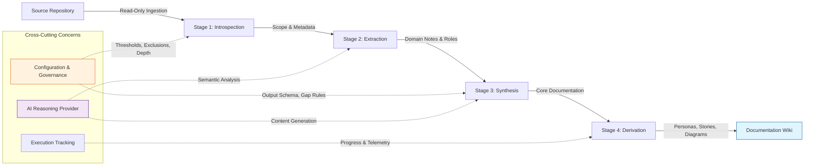

## Core Intent

The system functions as an automated knowledge translation engine designed to analyze legacy or complex source code repositories and generate a structured, technology-agnostic documentation wiki. Its primary purpose is to decouple business intent and functional capabilities from technical implementation details, enabling stakeholders to reconstruct system understanding without direct interaction with the original codebase.

Key objectives include:

- **Legacy System Modernization:** Provide migration teams with a reliable, domain-focused specification that captures business rules, user flows, and architectural constraints, reducing risk during system rebuilds.
- **Rapid Onboarding:** Accelerate engineer and stakeholder ramp-up by synthesizing fragmented code artifacts into coherent narratives, personas, and behavioral models.
- **Documentation Standardization:** Eliminate documentation debt by enforcing consistent output schemas, technology independence, and traceability from generated content back to source artifacts.
- **Evidence-Based Analysis:** Leverage automated reasoning to infer intent while maintaining strict guardrails against speculation, ensuring all outputs are grounded in verifiable repository data.

## Problem Space and Value Proposition

The system addresses critical challenges associated with legacy system maintenance, knowledge preservation, and modernization initiatives.

| Problem Domain | Operational Impact | System Response |
| :--- | :--- | :--- |
| **Legacy Knowledge Erosion** | Business logic is implicit in code; tribal knowledge is lost; onboarding requires deep technical diving. | Automatically extracts domain concepts, user stories, and integration flows into a persistent, searchable wiki. |
| **Migration Risk** | Rebuilding systems based on incomplete understanding leads to functional gaps and regression. | Generates technology-agnostic specifications that preserve business intent independent of original tech stack. |
| **Repository Noise** | Build artifacts, empty files, and non-essential metadata obscure meaningful analysis. | Implements deterministic filtering based on content substance and configuration-driven exclusions. |
| **AI Hallucination Risk** | Generative models may fabricate facts or invent requirements not present in the source. | Enforces explicit gap declarations, prohibits fabrication, and requires traceability to extraction notes. |
| **Inconsistent Documentation** | Manual docs drift from code; terminology varies across teams. | Standardizes output formats, enforces schema validation, and maintains versioned extraction records. |
| **Resource Constraints** | Deep analysis of large repositories consumes excessive computational resources. | Tunes reasoning depth and processing scope; filters low-value inputs; prioritizes high-fidelity output. |

## Operational Boundaries

The system operates within defined functional and architectural limits to ensure reliability and focus.

- **Scope Limitation:** The tool is strictly an extraction and synthesis engine. It does **not** perform code transformation, refactoring, migration execution, or deployment. Downstream actions are delegated to migration teams or other tooling consuming the generated wiki.
- **Pipeline Determinism:** Execution follows a fixed, unidirectional sequence: Introspection → Extraction → Synthesis → Derivation. Deviations or out-of-order processing are prohibited.
- **Provider Abstraction:** AI capabilities are accessed through a standardized interface. The system supports multiple inference backends but defaults to local execution with zero cloud dependency. Provider selection is configuration-driven and transparent to the core workflow.
- **Data Safety:** All operations are non-destructive. Source repositories are read-only; intermediate artifacts and outputs are isolated in dedicated workspaces.
- **Output Integrity:** Generated content must remain technology-agnostic. Behavioral descriptions use structured formats (e.g., Given/When/Then), and missing information is explicitly flagged rather than inferred.

## Behavioral Protocols

The system enforces strict behavioral rules to guarantee consistency, traceability, and quality.

### Pipeline Execution
- **Given** a target repository and valid configuration, **When** the analysis is initiated, **Then** the system executes a four-stage pipeline: (1) Structural introspection, (2) File-level extraction, (3) Content synthesis, and (4) Derivative generation.
- **Given** a stage completes successfully, **When** transitioning to the next stage, **Then** intermediate results are persisted to support incremental processing and auditability.

### Content Synthesis
- **Given** extracted domain notes and introspection assessments, **When** generating documentation sections, **Then** the system produces technology-agnostic narratives focused on business intent, excluding implementation-specific details.
- **Given** ambiguity or missing data in the source repository, **When** synthesizing content, **Then** the system inserts explicit gap declarations and refrains from fabricating requirements or behaviors.
- **Given** a request for behavioral documentation, **When** outputting user stories or acceptance criteria, **Then** the system formats content using structured behavioral syntax to ensure clarity.

### Filtering and Scope Control
- **Given** a repository containing diverse file types, **When** scanning for analysis targets, **Then** the system excludes version control metadata, build artifacts, and files below content thresholds.
- **Given** configuration-defined exclusions, **When** processing files, **Then** the system applies these rules to bypass non-essential paths, preserving computational resources for substantive artifacts.

### Error Handling
- **Given** an invalid file or processing failure, **When** the pipeline encounters the error, **Then** the system logs the failure, skips the affected artifact, and continues execution without halting the entire workflow.

## System Schematic

## Specification Gaps

The following areas lack complete definition and require further specification or implementation decisions:

- **Note-to-Section Mapping:** Heuristics for how intermediate extraction notes are prioritized, aggregated, and mapped to final documentation sections are undefined.
- **Conflict Resolution:** Strategies for reconciling contradictory insights derived from different source files or extraction passes are not specified.
- **Security and Access Control:** Authentication, authorization, and data protection requirements for workspace management and provider interactions remain undefined.
- **Non-Essential Artifact Classification:** Explicit rules for classifying and handling ambiguous or borderline artifacts (e.g., configuration vs. business logic) are missing.
- **Inter-Module Schemas:** Data serialization formats for handoffs between pipeline stages are not fully standardized.
- **Retry and Fallback Mechanisms:** Operational contracts for transient failures, retry policies, and provider fallback strategies are not established.