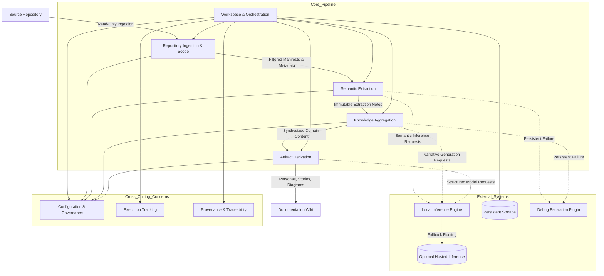
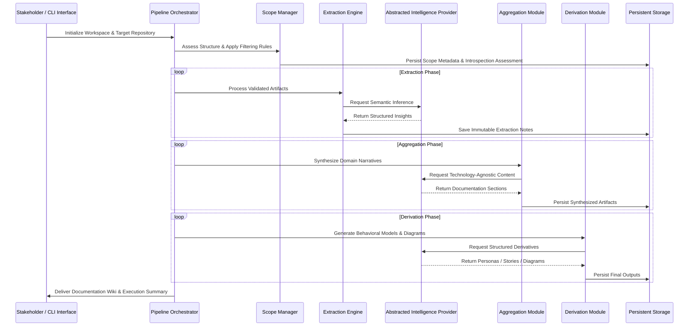

## High-Level System Structure

## Behavioral & State Flow Progression

## Component & Context Mapping

| Bounded Context | Primary Responsibility | Input Artifact | Output Artifact | Integration Pattern |
| :--- | :--- | :--- | :--- | :--- |
| **Workspace & Orchestration** | Lifecycle management, stage gating, state persistence, fault tolerance | Configuration, Target Repository | Execution Summary, State Checkpoints | Central coordinator; serializes intermediate states |
| **Repository Ingestion** | Scope definition, directory traversal, exclusion filtering, manifest detection | Source Repository | Scope Manifest, File Inventory | Provider of filtered paths and structural metadata |
| **Semantic Extraction** | File-level parsing, business logic inference, role assignment, note generation | Scope Manifest, Source Artifacts | Immutable Extraction Notes | Consumer of manifests; producer of timestamped records |
| **Knowledge Aggregation** | Note merging, technology-agnostic synthesis, gap declaration, narrative construction | Extraction Notes, Introspection Assessment | Documentation Sections, Domain Narratives | Consumer of notes; enforces fidelity and traceability rules |
| **Artifact Derivation** | Transformation of synthesized content into structured behavioral models | Documentation Sections | User Personas, User Stories, System Diagrams | Consumer of documentation; producer of standardized derivatives |
| **Intelligence Provider** | Abstraction of external inference capabilities, prompt routing, response normalization | Structured Prompts | Validated JSON/Text Responses | Factory-instantiated client; supports local-first and hosted extensions |
| **Configuration & Governance** | Parameter management, threshold enforcement, provider selection, override resolution | Local Config, Environment Variables | Operational Profile | Hierarchical resolver; overrides applied at initialization |

## Cross-Cutting Integration Points

- **Traceability & Provenance:** Every synthesized section and derivative artifact maintains explicit linkage to immutable extraction notes and originating source paths. Timestamps and path sanitization are enforced to prevent data drift.
- **Configuration Hierarchy:** Local workspace definitions strictly override environment variables. Parameters govern reasoning depth, content thresholds, exclusion semantics, and provider routing without altering core pipeline logic.
- **State Isolation & Fault Tolerance:** Intermediate artifacts are persisted independently of version control. Stage-gated execution ensures that failures in one component trigger logging and artifact skipping, allowing downstream phases to proceed without halting the entire workflow.
- **Provider Abstraction Contract:** All intelligence interactions are routed through a standardized interface supporting direct prompt completion and multi-turn reasoning. Structured output validation prevents pipeline degradation from malformed responses.
- **Deterministic Execution Guardrails:** The pipeline enforces a strict unidirectional sequence. Backtracking, parallel stage execution, or direct raw source access during synthesis/derivation is prohibited to maintain reproducibility.

## Specification Gaps & Missing Data

The following aspects of the system diagrams and integration architecture lack explicit definition in the primary documentation and are intentionally excluded to prevent fabrication:

- **Inter-Module Data Serialization Schemas:** Exact JSON/struct formats for handoffs between extraction, aggregation, and derivation stages are not standardized. Diagrams assume validated model exchange but do not define field-level contracts.
- **Conflict Resolution & Reconciliation Logic:** Strategies for handling contradictory insights across multiple extraction notes or parallel processing paths are unspecified. The diagrams reflect sequential aggregation without depicting merge-resolution algorithms.
- **Transient Failure & Retry Contracts:** Timeout thresholds, exponential backoff policies, and fallback routing behaviors for the intelligence provider and persistent storage are undefined. Fault tolerance is shown conceptually but lacks operational retry mechanics.
- **Security & Access Control Boundaries:** Authentication, authorization, role-based workspace isolation, and secret management for provider endpoints are not modeled. The architecture assumes a trusted execution context.
- **Heuristic Classification Rules:** Deterministic thresholds for noise filtration, borderline artifact classification, and non-essential metadata exclusion are configurable but lack formal domain-driven classification logic. Diagrams represent filtered inputs without specifying evaluation heuristics.