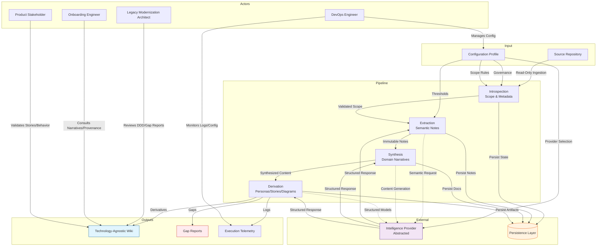
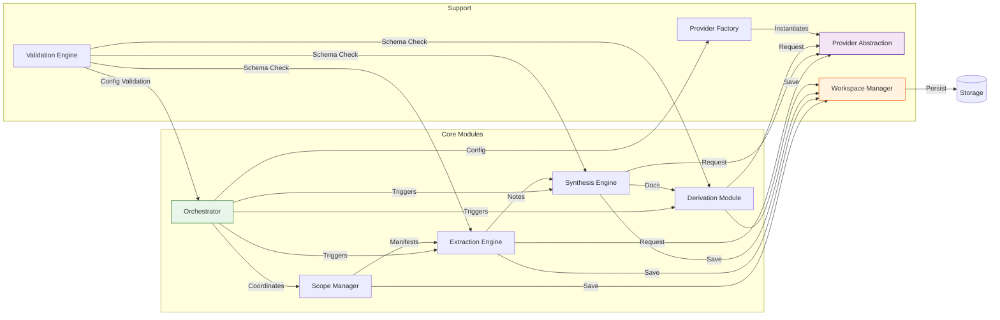

## User Personas

### Legacy Modernization Architect
- **Intent:** De-risk system migration by decoupling business intent from technical implementation, ensuring functional parity during rebuilds without relying on tribal knowledge or direct code analysis.
- **Needs:**
  - Technology-agnostic documentation that preserves domain logic independent of the original tech stack.
  - Explicit gap declarations to identify missing requirements or contradictions before migration work begins.
  - Domain-Driven Design (DDD) models, bounded contexts, and integration flow maps to reconstruct architectural understanding.
  - Traceability links from synthesized content back to source artifacts for auditability and validation.
- **Painpoints:**
  - Legacy knowledge erosion leads to functional regression and silent bugs during modernization.
  - Repository noise (build artifacts, empty files) obscures meaningful analysis and wastes review time.
  - Manual documentation drifts from code, creating unreliable reference material.
  - AI hallucination risks introduce fabricated requirements if guardrails are insufficient.
- **Usage Patterns:**
  - Initiates full pipeline analysis on target repositories to generate comprehensive wikis.
  - Reviews synthesized domain narratives and gap reports to assess readiness for migration.
  - Validates traceability by cross-referencing documentation claims with extraction notes.
  - Uses derived artifacts to brief downstream teams on business rules and constraints.
- **Use Cases:**
  - Generate DDD bounded context models and entity relationships.
  - Identify and report missing business rules or contradictory insights.
  - Validate technology independence of generated documentation.
  - Review traceability metadata to verify evidence-based synthesis.

### Onboarding Engineer
- **Intent:** Accelerate ramp-up time and achieve functional system understanding without deep diving into legacy codebases or depending on unavailable subject matter experts.
- **Needs:**
  - Coherent domain narratives that explain system purpose, capabilities, and user flows.
  - Structured user stories and behavioral models to understand expected system behavior.
  - System diagrams and structural overviews to visualize components and dependencies.
  - Access to provenance data to verify claims and understand the origin of specific insights.
- **Painpoints:**
  - Steep learning curves due to fragmented artifacts and implicit logic embedded in code.
  - Loss of institutional knowledge when key personnel leave the organization.
  - Inconsistent terminology and documentation formats across different system components.
  - Difficulty distinguishing between business logic and implementation details.
- **Usage Patterns:**
  - Consults the generated documentation wiki as the primary source for system onboarding.
  - Reviews user personas and stories to grasp user interactions and functional scope.
  - Uses traceability links to explore source artifacts when deeper technical context is required.
  - Relies on gap markers to identify areas requiring further manual investigation or clarification.
- **Use Cases:**
  - Access generated user personas to understand stakeholder roles.
  - Read domain narratives to infer business goals and solution capabilities.
  - Review behavioral user stories formatted in standardized syntax.
  - Verify artifact provenance via timestamped extraction records.

### Product Stakeholder
- **Intent:** Verify that business requirements, user flows, and functional scope are accurately preserved and documented, independent of technical implementation details.
- **Needs:**
  - Behavioral documentation using standardized formats (e.g., Given/When/Then) for clarity and testability.
  - User stories that reflect actual business value and functional responsibilities.
  - Awareness of gaps or ambiguities to prioritize requirement clarification or scope refinement.
  - Standardized output schemas to ensure consistency across multiple systems or modules.
- **Painpoints:**
  - Technical jargon and code-centric documentation create barriers to understanding business intent.
  - Inconsistent documentation quality leads to misinterpretation of requirements.
  - Lack of visibility into missing information results in assumptions and downstream errors.
  - Difficulty tracking changes or validating that documentation aligns with current business rules.
- **Usage Patterns:**
  - Reviews behavioral stories and acceptance criteria to validate functional coverage.
  - Assesses gap declarations to identify missing business logic or conflicting requirements.
  - Uses derived user personas to align documentation with stakeholder expectations.
  - Monitors documentation standardization to ensure uniform terminology and structure.
- **Use Cases:**
  - Extract user stories to validate business rule preservation.
  - Review behavioral acceptance criteria for functional clarity.
  - Assess documentation completeness via gap reports.
  - Verify alignment between generated personas and stakeholder definitions.

### DevOps & Platform Engineer
- **Intent:** Ensure reproducible, secure, and efficient execution of the analysis pipeline, managing configuration, resource utilization, and external integrations.
- **Needs:**
  - Configuration governance to manage thresholds, exclusions, and reasoning depth.
  - Provider abstraction to swap intelligence backends without disrupting core workflows.
  - Telemetry and execution summaries to monitor pipeline progress and diagnose failures.
  - Fault tolerance mechanisms to handle errors gracefully without halting processing.
- **Painpoints:**
  - Resource constraints when analyzing large repositories with high reasoning depth.
  - Non-deterministic behavior or inconsistent results due to uncontrolled external dependencies.
  - Cloud dependency issues in isolated environments or restricted networks.
  - Lack of retry logic or fallback strategies for transient provider failures.
- **Usage Patterns:**
  - Configures operational profiles to tune filtering rules, content bounds, and provider selection.
  - Monitors execution telemetry to track stage completion and identify bottlenecks.
  - Manages workspace isolation to prevent repository bloat and ensure clean outputs.
  - Handles scope exclusions to bypass non-essential paths and optimize processing efficiency.
- **Use Cases:**
  - Switch inference backend via configuration without modifying pipeline logic.
  - Configure file filtering thresholds to balance fidelity and resource usage.
  - Review execution summary logs for stage metrics and error details.
  - Manage workspace state persistence to support incremental processing.

## User Stories

### Legacy Modernization Architect
**Feature: Gap Declaration and Traceability**
```gherkin
Given a target repository contains ambiguous or contradictory source artifacts,
When the analysis pipeline completes synthesis,
Then the system must generate explicit gap declarations in the documentation,
And the system must not fabricate content to fill informational voids,
And every generated claim must include a traceability link to the originating extraction note.
```

**Feature: Technology-Agnostic Synthesis**
```gherkin
Given a repository with complex implementation-specific code constructs,
When the synthesis phase aggregates extraction notes,
Then the resulting documentation must abstract technical details,
And the output must focus exclusively on business intent and domain semantics,
And the architectural description must remain independent of the original technology stack.
```

### Onboarding Engineer
**Feature: Provenance Verification**
```gherkin
Given a documentation section contains a specific domain insight,
When the engineer reviews the artifact,
Then the system must provide an immutable timestamp and sanitized source path,
And the extraction note must be linked to the originating file,
And the record must be immutable to preserve auditability.
```

**Feature: Behavioral Model Access**
```gherkin
Given the derivation phase has processed synthesized content,
When the engineer requests behavioral documentation,
Then the system must produce user stories and acceptance criteria,
And the content must be formatted using standardized Given/When/Then notation,
And the behavioral models must align with the inferred system purpose.
```

### Product Stakeholder
**Feature: Requirement Validation**
```gherkin
Given a set of business requirements defined in source artifacts,
When the pipeline extracts and synthesizes domain knowledge,
Then the generated user stories must reflect the functional responsibilities,
And the output must use consistent terminology across all documentation sections,
And the system must flag any contradictions as gaps requiring manual resolution.
```

### DevOps & Platform Engineer
**Feature: Provider Configuration and Fault Tolerance**
```gherkin
Given a configuration specifying a local intelligence provider,
When the pipeline executes in an isolated environment,
Then the system must route all semantic requests through the provider abstraction layer,
And the system must operate without external network dependency,
And the system must skip invalid artifacts and continue processing without halting the pipeline.
```

**Feature: Resource Management and Scope Control**
```gherkin
Given a repository contains files exceeding the configured size threshold,
When the scope manager traverses the directory structure,
Then the system must exclude oversized files from analysis,
And the exclusion must be logged in the execution summary,
And the system must retain files for potential downstream truncation only if flagged by configuration.
```

## System Diagrams

### High-Level Pipeline and Artifact Flow


### Component Interaction and Data Flow


## Missing Data

- **Security and Access Control:** Authentication, authorization, and role-based access requirements for workspace management, generated artifacts, and external provider interactions are undefined. Multi-user scenarios and data isolation mechanisms are not specified.
- **Conflict Resolution Strategies:** Heuristics and algorithms for reconciling contradictory insights derived from different source files or extraction passes are unspecified. The system lacks defined logic for prioritizing or merging conflicting domain narratives.
- **Mapping Logic:** Explicit rules for how intermediate extraction notes are mapped, prioritized, filtered, and aggregated into final documentation sections are missing. The derivation path from granular notes to synthesized sections relies on implicit behavior.
- **Error Handling and Retry Contracts:** Detailed operational contracts for transient failure recovery, retry mechanisms, backoff policies, and fallback strategies during intelligence provider unavailability are not defined.
- **Data Serialization Schemas:** Formal contracts and schemas for data serialization between pipeline stages and inter-module handoffs are absent, posing risks for state management and interoperability.
- **Non-Essential Artifact Classification:** Rules for classifying ambiguous artifacts (e.g., configuration vs. business logic) and filtering noise based on domain-driven heuristics are not formalized beyond configurable thresholds.
- **Database Engine Specifics:** The underlying database engine, schema version, and detailed storage schema for extraction notes and telemetry are not explicitly identified.