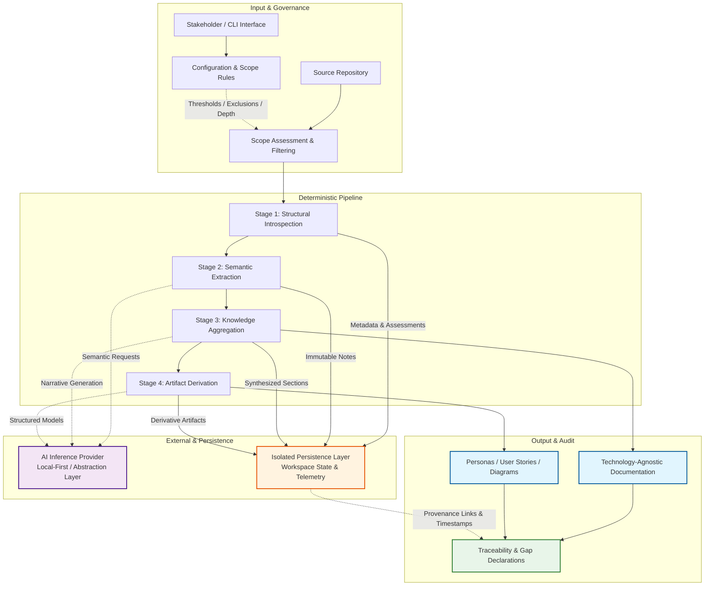

## User Personas

| Persona | Intent | Needs | Pain Points | Usage Patterns | Key Use Cases |
| :--- | :--- | :--- | :--- | :--- | :--- |
| **Migration Lead** | Rebuild or modernize legacy systems accurately without referencing original source code | Technology-agnostic business logic, clear integration flows, explicit gap markers, deterministic execution | Tribal knowledge loss, high migration risk, incomplete architectural context | Initiates full pipeline runs, reviews synthesized wiki, validates scope boundaries, plans rebuild phases based on traceable insights | Domain context extraction, migration risk assessment, dependency mapping, gap tracking |
| **Onboarding Engineer** | Rapidly comprehend system capabilities, user workflows, and functional responsibilities | Structured domain narratives, behavioral models, provenance links, consistent terminology | Steep learning curve, fragmented documentation, hidden business rules, inconsistent naming conventions | Searches generated stories and diagrams, follows traceability links to source artifacts, validates behavioral acceptance criteria | Quick ramp-up, workflow validation, role/responsibility mapping, domain onboarding |
| **Documentation Steward** | Maintain standardized, auditable, and reproducible domain documentation | Strict schema validation, config-driven boundaries, immutable extraction records, telemetry visibility | Manual documentation drift, AI hallucination risk, untraceable claims, schema inconsistencies | Configures filtering thresholds, monitors pipeline telemetry, audits traceability metadata, enforces quality gates | Quality gate enforcement, audit trail verification, configuration management, compliance validation |

## User Stories

### Story 1: Deterministic Pipeline Execution & Scope Control
**Keyed to Persona:** Migration Lead  
**As a** Migration Lead, **I want to** initiate a stage-gated analysis pipeline with configurable scope boundaries, **so that** I can reliably extract domain context without processing repository noise or exceeding resource limits.

**Scenario:**
- **Given** a target repository and a configuration profile defining file size thresholds, exclusion paths, and reasoning depth,
- **When** the analysis pipeline is initiated,
- **Then** execution must proceed strictly through four sequential stages: Introspection → Extraction → Aggregation → Derivation.

**Acceptance Criteria:**
- Scope assessment completes and persists metadata before any semantic analysis occurs.
- Files below minimum content thresholds or matching exclusion rules are skipped without halting downstream stages.
- Intermediate states are persisted between stages to support incremental processing and fault recovery.
- Output directory structure and schema remain immutable across subsequent runs.

---

### Story 2: Semantic Extraction & Technology Agnosticism
**Keyed to Persona:** Onboarding Engineer  
**As an** Onboarding Engineer, **I want to** consume synthesized documentation that abstracts implementation details, **so that** I can understand business intent and functional responsibilities independent of the original tech stack.

**Scenario:**
- **Given** extraction notes and introspection assessments are available from the upstream pipeline,
- **When** the system aggregates findings into documentation sections,
- **Then** all generated narratives must focus exclusively on domain semantics, user flows, and architectural constraints.

**Acceptance Criteria:**
- Technical stack specifics, framework dependencies, and language-specific constructs are stripped from outputs.
- Behavioral descriptions utilize standardized conditional notation to ensure unambiguous interpretation.
- Role assignments and functional responsibilities are explicitly mapped to source artifacts.
- Contradictory insights across multiple files trigger explicit gap markers rather than inferred resolutions.

---

### Story 3: Gap Declaration & Traceability
**Keyed to Persona:** Documentation Steward  
**As a** Documentation Steward, **I want to** verify that every claim in the generated wiki is traceable to immutable source records, **so that** I can audit analytical accuracy and prevent speculative content generation.

**Scenario:**
- **Given** a synthesized documentation section is generated during the aggregation phase,
- **When** provenance links and fidelity rules are evaluated,
- **Then** each insight must reference timestamped extraction notes tied to sanitized source file paths.

**Acceptance Criteria:**
- No content is fabricated to fill informational voids; missing data is explicitly declared as a gap.
- Extraction notes remain immutable post-creation to preserve auditability and prevent drift.
- Traceability metadata includes file type associations, manifest references, and processing timestamps.
- Execution telemetry logs stage completion status, success metrics, and gap counts for steward review.

---

### Story 4: Provider Abstraction & Fault Tolerance
**Keyed to Persona:** Migration Lead  
**As a** Migration Lead, **I want to** route semantic analysis through a standardized intelligence abstraction, **so that** I can swap inference backends without disrupting pipeline execution or compromising data privacy.

**Scenario:**
- **Given** a configuration specifying an analysis backend and structured output requirements,
- **When** the provider factory initializes the client,
- **Then** the system must instantiate the corresponding adapter and enforce strict schema validation on responses.

**Acceptance Criteria:**
- Local inference is prioritized by default with zero cloud dependency to ensure data privacy.
- Hosted backends are treated as optional extensions conforming to the provider abstraction contract.
- Malformed AI responses trigger graceful fallback logging without halting the pipeline.
- Unsupported or unconfigured providers fail fast during initialization with clear validation errors.

## System Diagram (10,000-Foot View)

## Specification Gaps & Missing Data

The following operational and structural requirements are explicitly undefined in the current documentation. These gaps must be resolved before production deployment or advanced pipeline configuration:

- **Note-to-Section Mapping Logic:** Deterministic heuristics for prioritizing, filtering, and mapping intermediate extraction notes to final documentation sections are not specified.
- **Conflict Resolution Strategies:** Rules for reconciling contradictory business logic or architectural insights inferred from different source artifacts are missing.
- **Security & Access Control:** Authentication, authorization, role-based access, and secret management for workspace isolation and external provider interactions are undefined.
- **Data Serialization Schemas:** Formal contracts for inter-module data handoffs, intermediate state serialization formats, and schema versioning are absent.
- **Error Handling & Retry Policies:** Specific retry thresholds, backoff mechanisms, fallback strategies, and timeout constraints for transient AI provider failures are not established.
- **Non-Essential Artifact Classification:** Explicit domain-driven rules for classifying ambiguous files (e.g., configuration vs. business logic) and noise filtration heuristics rely solely on configurable thresholds without formal classification logic.