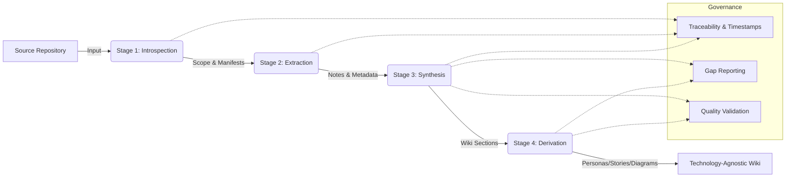

## Purpose and Value Proposition

The application serves as an automated knowledge translation engine designed to extract, analyze, and synthesize functional and architectural context from legacy software systems. It transforms raw source artifacts into a standardized, technology-agnostic documentation wiki, decoupling business intent from technical implementation details.

The system addresses critical challenges in software lifecycle management by:
- **De-risking Migration:** Enables development teams to rebuild or modernize systems using generated documentation without referencing the original codebase.
- **Accelerating Onboarding:** Provides immediate access to domain logic, user personas, and structural overviews for new practitioners.
- **Preserving Institutional Knowledge:** Captures volatile legacy context in durable, structured formats, preventing knowledge loss as systems age or staff turnover.
- **Standardizing Documentation:** Enforces consistent quality, traceability, and semantic structure across diverse repositories.

## Core Capabilities

| Capability Category | Functionality Description |
| :--- | :--- |
| **Repository Introspection** | Scans target directories to determine scope, identifies manifest and configuration artifacts, and filters non-essential or noisy files based on configurable thresholds. |
| **Semantic Extraction** | Analyzes source files to infer project purpose, architectural intent, and domain-specific business logic while explicitly excluding implementation-specific details. |
| **Documentation Synthesis** | Aggregates extraction results into structured wiki sections covering eight core domain areas, including DDD modeling, integration flows, and hard specifications. |
| **Derivative Generation** | Produces downstream artifacts such as user personas, behavioral user stories, and system diagrams based on synthesized content. |
| **Traceability Management** | Maintains immutable links between generated documentation and source artifacts, including timestamps and provenance metadata for auditability. |
| **Configurable Analysis** | Supports tunable parameters for reasoning depth, content boundaries, and processing exclusions to balance analytical fidelity with resource efficiency. |

## Domain Coverage

The system structures output around a canonical framework ensuring comprehensive domain representation:

- **Domain-Driven Design Modeling:** Bounded contexts and entity relationships.
- **Problem Space and Intent:** Business goals and solution capabilities.
- **Dependency and Integration Mapping:** System interactions and external contracts.
- **Cross-Cutting Concerns:** Operational and architectural constraints.
- **Entity Structures:** Data models and state definitions.
- **Hard Specifications:** Immutable requirements and behavioral constraints.

## Operational Workflow

The application executes a deterministic, stage-gated pipeline. Operational behavior adheres to strict sequencing and integrity protocols.

### Pipeline Execution Logic

| Condition | Action | Result |
| :--- | :--- | :--- |
| **Given** a target repository and configuration parameters are provided. | **When** the analysis pipeline is initiated. | **Then** the system performs repository introspection to establish scope and file boundaries. |
| **Given** the scope is defined and filtering rules are active. | **When** the extraction phase begins. | **Then** the system traverses included files, extracting business logic and metadata while discarding unstructured or irrelevant content. |
| **Given** extraction notes and system assessments are collected. | **When** the synthesis phase triggers. | **Then** the system aggregates data into technology-agnostic wiki sections, enforcing factual accuracy and prohibiting content fabrication. |
| **Given** primary documentation is synthesized. | **When** the derivation phase executes. | **Then** the system generates derivative artifacts (personas, stories, diagrams) and reports explicit gaps where information is insufficient. |

### Schematic

The following diagram illustrates the unidirectional data flow and processing stages:

## Governance and Integrity Constraints

The system enforces rigorous standards to ensure output reliability and usability:

- **Technology Independence:** All output narratives abstract underlying technical stacks, focusing exclusively on domain semantics and business value.
- **Explicit Gap Preservation:** When source artifacts lack sufficient information to determine requirements or structure, the system declares missing data rather than inferring or fabricating content.
- **Deterministic Execution:** Processing follows a fixed sequence without backtracking; intermediate states are persisted to support incremental processing and fault tolerance.
- **Non-Destructive Operation:** The system reads source artifacts without modification, generating isolated output artifacts that do not alter the original repository.
- **Behavioral Clarity:** Behavioral descriptions utilize standardized structures (e.g., Given/When/Then) to ensure unambiguous interpretation.

## Known Specification Limitations

The following areas are identified as missing or undefined within the current scope and are explicitly excluded from documentation:
- Access control and authentication mechanisms for generated artifacts.
- Heuristics for reconciling contradictory insights across multiple source files.
- Detailed error handling and retry strategies for external service interactions.
- Conflict resolution strategies for concurrent workspace modifications.