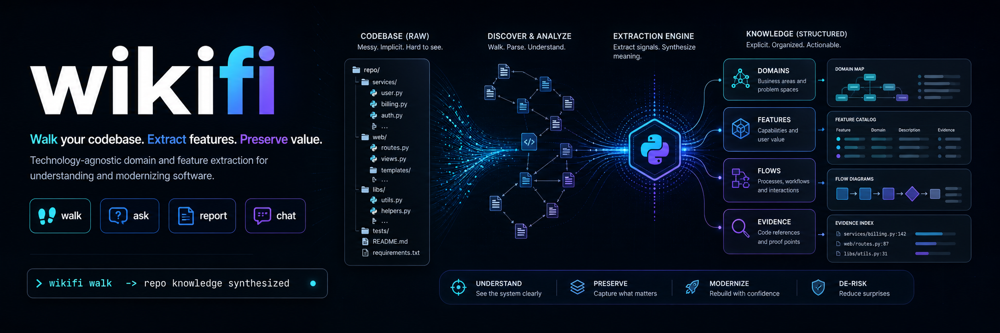

# wikifi

wikifi walks a legacy codebase and writes a **technology-agnostic** wiki of what the system does — domains, entities, flows, integrations, and cross-cutting concerns — extracted from the source with citations back to the lines that prove it.

The output is what a migration team needs to re-implement the system on a fresh stack from the wiki alone, without recreating the legacy structure in a new language.

For the full rationale and content contract, see [VISION.md](./VISION.md). To see the output, browse [`.wikifi/`](./.wikifi/) — wikifi run against its own source.

## Quickstart

```bash
# 1. Install in the target project
uv add wikifi

# 2. Scaffold .wikifi/ and config
uv run wikifi init

# 3. Walk the codebase
uv run wikifi walk
```

### LLM Config 

`.wikifi/config.toml`
```
provider = "anthropic" # openai | local(default)
model = "claude-sonnet-4-6" 
# ollama_host = "http://localhost:11434"
```

By default wikifi runs against a **local Ollama** server (Qwen 3 27B at the highest reasoning level the model exposes) — no cloud dependency, no API key, no data leaving the machine. Hosted Anthropic and OpenAI backends are opt-in.

## What you get

A `.wikifi/` directory in the target repo containing the synthesized wiki. The on-disk layout is at the implementor's discretion; the **content contract** is fixed and lives in [VISION.md](./VISION.md):

- **Primary capture** (extracted from source) — domains & subdomains, intent, capabilities, entities, integrations, external dependencies, cross-cutting concerns, hard specifications, and inline schematics.
- **Derivative capture** (synthesized from the aggregate) — personas, user stories, and 10,000-foot diagrams produced *after* primary content is complete.

Every claim in the wiki carries a numbered citation back to a `SourceRef` (file + line range + content fingerprint). Conflicting evidence across files is preserved in a "Conflicts in source" block rather than silently resolved.

## CLI

| Command | Purpose |
| --- | --- |
| `wikifi init` | One-time setup. Scaffolds `.wikifi/` and local config. |
| `wikifi walk` | Walks the target codebase and produces the wiki. |
| `wikifi report` | Coverage + quality report (per-section file counts, findings, body sizes). |
| `wikifi ask` | Natural-language queries against the wiki, with optional context injection from the source. |
| `wikifi chat` | Interactive REPL for iterative exploration of the wiki and the source. |

`walk` flags:

- `--no-cache` — force a clean re-walk; drops the on-disk extraction + aggregation caches.
- `--review` — run the critic + reviser loop on derivative sections (personas, user stories, diagrams).
- `--provider {ollama|anthropic|openai}` — override the configured provider for this walk.

`report --score` runs the critic on every populated section for a 0–10 quality score.

## Providers

The LLM backend is reached through a provider abstraction; swapping it never touches the rest of the system.

- **`OllamaProvider`** — default. Local server, no cloud dependency.
- **`AnthropicProvider`** — `WIKIFI_PROVIDER=anthropic`. Uses prompt caching with `cache_control: ephemeral` on the system prompt so the multi-KB extraction prompt is paid for once across hundreds of per-file calls.
- **`OpenAIProvider`** — `WIKIFI_PROVIDER=openai`. Relies on OpenAI's automatic prefix caching and routes the `think` knob to `reasoning_effort` on `o*` / `gpt-5` reasoning models.

## How the walk works

The walk has four responsibilities, in order:

1. **Introspect** — review the target's root structure (manifests, top-level layout, gitignore signals) and decide which paths carry production source worth analyzing. The walk that follows is deterministic; the agent does not re-pick scope mid-walk.
2. **Filter** — recognize and skip unstructured or near-empty files (stub `__init__`, empty fixtures, generated lockfiles) before they reach the agent. Empty input must never stall the walk.
3. **Extract** — for each in-scope file, extract structured findings against the primary capture sections in [VISION.md](./VISION.md). Each finding carries a `SourceRef` for downstream citation.
4. **Synthesize** — primary sections are aggregated from the per-file findings into an `EvidenceBundle` (body + claims + contradictions). Derivative sections (personas, user stories, diagrams) are produced *after* primary content is complete, never inferred from a single file.

Supporting machinery:

- **Repo graph** ([`wikifi/repograph.py`](./wikifi/repograph.py)) — regex-driven static analysis builds an import / reference graph and classifies each file's `FileKind` (application code, SQL, OpenAPI, Protobuf, GraphQL, migration, other). Each file's neighborhood is injected into the extraction prompt so per-file findings can describe cross-file flows.
- **Specialized extractors** ([`wikifi/specialized/`](./wikifi/specialized/)) — schema files (SQL, OpenAPI, Protobuf, GraphQL, migrations) bypass the LLM and run through deterministic parsers. Structured findings reach the same notes store, so the rest of the pipeline is unchanged.
- **Content-addressed cache** ([`wikifi/cache.py`](./wikifi/cache.py)) — extraction findings are keyed by `(rel_path, sha256(file_bytes))`; aggregation bodies are keyed by a hash of the section's notes payload. Re-walks skip every file whose fingerprint hasn't changed; resumability after a crash is a free property of the same cache.
- **Critic + reviser** ([`wikifi/critic.py`](./wikifi/critic.py)) — opt-in via `walk --review`. Scores derivative sections against their brief and upstream evidence, identifies unsupported claims, and re-synthesizes when the score is below threshold. Only accepts a revision if it scores at least as well as the original.
- **Coverage + quality report** ([`wikifi/report.py`](./wikifi/report.py)) — `wikifi report` produces a per-section view of files contributing, finding count, body size, and (with `--score`) critic-derived quality scores.

## Configuration

wikifi reads configuration from environment variables. At minimum:

- the LLM provider id and model identifier
- the local Ollama endpoint (when using the default provider)
- bounds on file size and stripped-content size, so unstructured or oversized files never reach the agent
- the agent's thinking / reasoning level — defaults to the highest the chosen model supports

A `.env.example` will land once the surface is finalized.

## Tech stack

- **Python 3.12+**, packaged with [`uv`](https://docs.astral.sh/uv/)
- **Local LLM via Ollama** as the default runtime; thinking-capable model at the highest available reasoning level
- **Provider abstraction** — Ollama default; hosted Anthropic and OpenAI slot in without touching the rest of the system
- [`ruff`](https://docs.astral.sh/ruff/) as the single tool for lint and format
- `pytest` + `pytest-cov` for tests (≥85% coverage gate)
- **GitHub Actions** for CI

## Development

```bash
make hooks       # one-time: enables .githooks/ pre-commit + pre-push
uv sync          # install dependencies
make test        # run the test suite
```

See [CLAUDE.md](./CLAUDE.md) for the full development process — commands, code rules, agent workflow, and debug escalation.

## Distribution

wikifi ships as a Python library (PyPI / private index) and operates as a CLI invoked from a target project rather than as a server.

## License

MIT.
