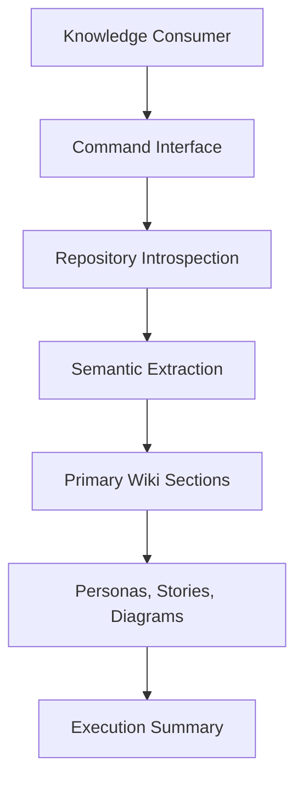
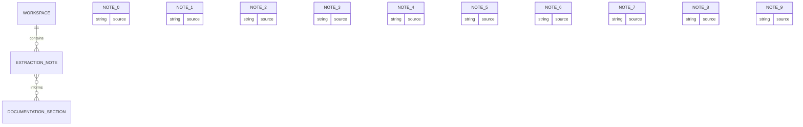
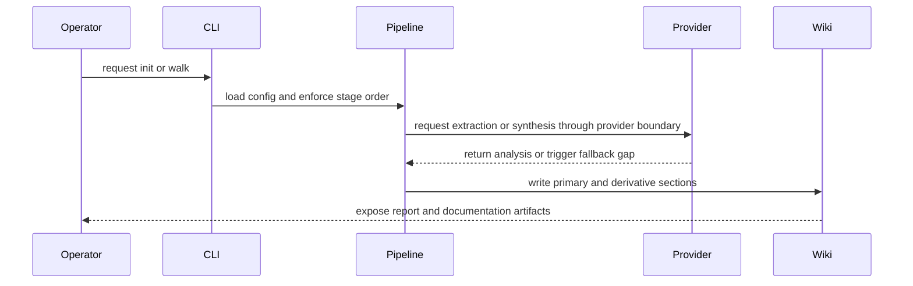

## Diagrams

Derived from finalized primary sections and the complete extraction-note set.

### 10000-Foot Flow

### Entity Evidence Map

| Source | Role | Categories |
| --- | --- | --- |
| __main__.py | Entry point for the Wikifi CLI application, responsible for invoking the main CLI function and handling process termination. | capabilities, cross_cutting, domains, external_dependencies, hard_specifications, intent |
| aggregation.py | Aggregation module that synthesizes extracted domain knowledge into structured wiki sections, preserving traceability and explicitly declaring gaps. | capabilities, cross_cutting, domains, entities, external_dependencies, hard_specifications, inline_schematics, integrations, intent |
| cli.py | Cli is a production source artifact in the wikified system boundary. | capabilities, cross_cutting, domains, inline_schematics, integrations, intent |
| config.py | Configuration loader and validator for a system named 'wikifi', managing settings via environment variables and local local configuration files. | capabilities, cross_cutting, domains, entities, external_dependencies, hard_specifications, inline_schematics, integrations, intent |
| constants.py | Defines static configuration constants and structural metadata for a system that processes code repositories to extract and aggregate domain knowledge. | capabilities, cross_cutting, domains, entities, external_dependencies, hard_specifications, intent |
| derivation.py | Derives secondary documentation artifacts (personas, user stories, diagrams) from primary wiki content and extraction notes, writing them to a derivatives directory and returning aggregation statistics. | capabilities, cross_cutting, domains, entities, external_dependencies, hard_specifications, inline_schematics, integrations, intent |
| extraction.py | Extraction orchestrator that converts source files into structured, technology-agnostic domain knowledge notes, with deterministic fallbacks when the AI provider is unavailable. | capabilities, cross_cutting, domains, entities, external_dependencies, hard_specifications, inline_schematics, integrations, intent |
| introspection.py | The system performs static analysis of a repository to infer its primary programming languages, purpose, and structural characteristics without parsing source code content. It relies on file extensions, directory structure, and documentation files to generate an assessment. | capabilities, cross_cutting, domains, entities, external_dependencies, hard_specifications, inline_schematics, integrations, intent |
| models.py | Defines the core data structures and configuration models for a file analysis and knowledge extraction pipeline. | capabilities, cross_cutting, domains, entities, external_dependencies, hard_specifications, inline_schematics, integrations, intent |
| orchestrator.py | Orchestrates a multi-stage content processing pipeline that discovers source files, extracts notes, aggregates sections, and derives additional content, while managing workspace setup, configuration, and execution metrics. | capabilities, cross_cutting, domains, entities, external_dependencies, hard_specifications, inline_schematics, integrations, intent |

### Integration Sequence

### Gap Declaration

These diagrams are abstract behavior maps and intentionally omit current implementation topology.

Primary context size used for derivation: 38270 characters.

