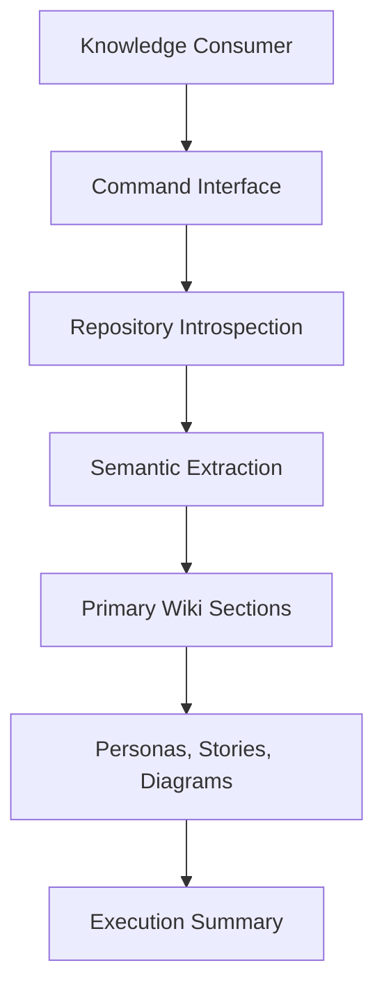
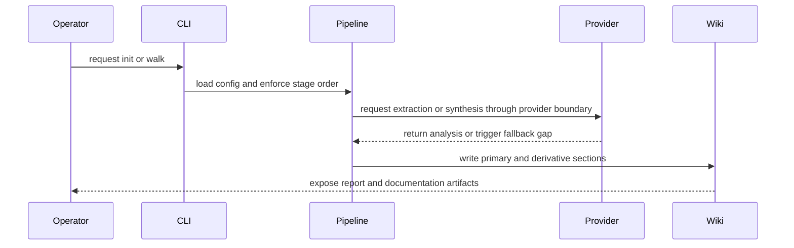

## Diagrams

Derived from finalized primary sections and the complete extraction-note set.

### 10000-Foot Flow

### Entity Evidence Map

| Source | Role | Categories |
| --- | --- | --- |
| __main__.py | Main is a production source artifact in the wikified system boundary. | capabilities, domains, inline_schematics, integrations, intent |
| aggregation.py | Aggregation is a production source artifact in the wikified system boundary. | capabilities, cross_cutting, domains, external_dependencies, hard_specifications, inline_schematics, integrations, intent |
| cli.py | Cli is a production source artifact in the wikified system boundary. | capabilities, cross_cutting, domains, inline_schematics, integrations, intent |
| config.py | Config is a production source artifact in the wikified system boundary. | capabilities, cross_cutting, domains, entities, external_dependencies, hard_specifications, inline_schematics, intent |
| constants.py | Constants is a production source artifact in the wikified system boundary. | capabilities, cross_cutting, domains, entities, external_dependencies, hard_specifications, inline_schematics, integrations, intent |
| derivation.py | Derivation is a production source artifact in the wikified system boundary. | capabilities, cross_cutting, domains, hard_specifications, inline_schematics, integrations, intent |
| extraction.py | Extraction is a production source artifact in the wikified system boundary. | capabilities, cross_cutting, domains, external_dependencies, hard_specifications, inline_schematics, intent |
| introspection.py | Introspection is a production source artifact in the wikified system boundary. | capabilities, cross_cutting, domains, hard_specifications, inline_schematics, integrations, intent |
| models.py | Models is a production source artifact in the wikified system boundary. | capabilities, cross_cutting, domains, entities, external_dependencies, hard_specifications, inline_schematics, intent |
| orchestrator.py | Orchestrator is a production source artifact in the wikified system boundary. | capabilities, cross_cutting, domains, entities, external_dependencies, hard_specifications, inline_schematics, integrations, intent |

### Integration Sequence

### Gap Declaration

These diagrams are abstract behavior maps and intentionally omit current implementation topology.

Primary context size used for derivation: 20075 characters.

