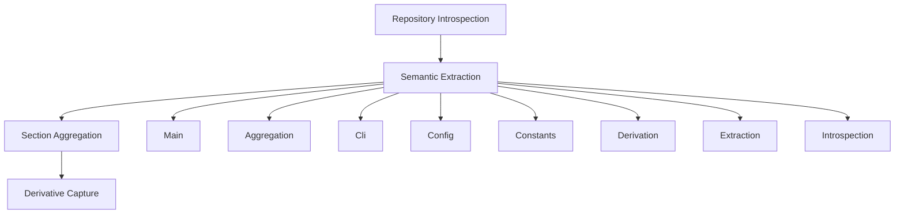

## Inline Schematics

Mermaid visualizations that clarify domains, entities, and integrations.

### Stage-Gated Knowledge Flow

### Gap Declaration

Diagrams represent aggregate source relationships and must not be treated as implementation architecture.

